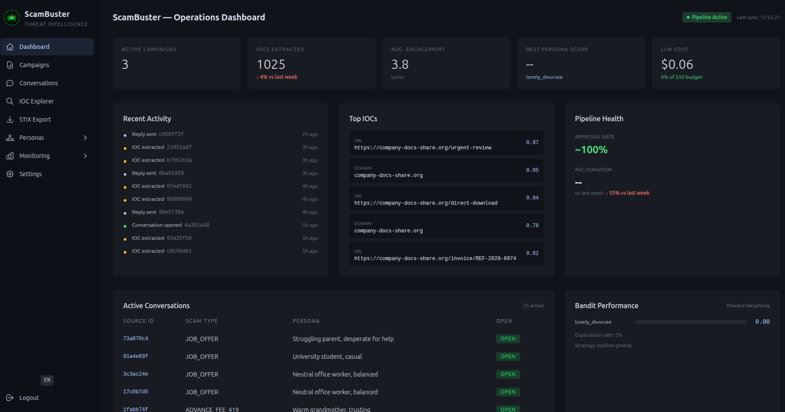

<p align="center">
  
</p>

<p align="center"><strong>A Defensive Engagement & Threat Intelligence Research Laboratory (Email-first)</strong></p>


[](https://codecov.io/gh/laugiov/scambuster)
[](LICENSE)
[](https://github.com/laugiov/scambuster/actions/workflows/ci.yml)
[](docker-compose.yml)
[](docs/03_high_level_architecture.md)
[](CONTRIBUTING.md)

> **Last updated**: 2026-04-03 | **Data period**: December 2025 - ongoing

<p align="center">
  
</p>

ScamBuster turns inbound scam emails into **actionable threat intelligence** through **controlled, policy-driven engagement**.

> **Try the demo** (no install): [Live Demo](https://frontend-production-b836.up.railway.app) — login: `user@example.com` / `Un1que$trongPassword2024`
>
> **Install locally in 5 minutes**: [Quickstart Guide](docs/QUICKSTART.md) — `cp .env.dist .env` → edit 4 values → `make quickstart` → done.
>
> **Run demo locally** (no API key needed): [Demo Guide](docs/DEMO.md) — `make demo-up` → http://localhost:3002

The project serves defensive security, fraud prevention, and applied research purposes (not offensive use). It extracts IOCs, maps campaigns, measures engagement effectiveness, and exports intelligence in STIX/MISP formats. All workflows are safety-gated, cost-aware, and fully auditable.

This is an academic research project (Master's thesis, E-MSc Cybersecurity) exploring a novel intersection of conversational AI, game theory, and cyber threat intelligence.

---

## The Problem: Email Scams Are High-Volume, and Mostly "Invisible" to Defenders

Email scams operate at massive scale. Most security programs are forced into a **block-and-forget** posture: the message is removed, but the attacker infrastructure, financial rails, and campaign signals remain largely unobserved. Industry estimates and sourced figures are documented in [Problem Statement](docs/01_problem_statement.md).

This creates a structural gap. There is little to no attribution across messages and campaigns, limited visibility into evolving TTPs and infrastructure reuse, and slow feedback loops on what actually works. Most organizations miss opportunities to generate intelligence from real-world interaction with threat actors.

ScamBuster explores this gap by converting scam emails into measurable threat intelligence, safely and at scale.

---

## ScamBuster: From Blocking to Understanding

ScamBuster is a **research laboratory** that transforms email scams into actionable intelligence through controlled AI engagement.

### The Vision: A Scam Observatory

Instead of discarding scam emails, ScamBuster creates an **observatory** that answers critical questions:

| Question | ScamBuster Insight |
|----------|-------------------|
| **What scam types are trending?** | Real-time classification across 13 types |
| **Which personas maximize engagement?** | Adaptive learning identifies optimal strategies per scam type |
| **What IOCs do scammers reveal?** | Automatic extraction of 40+ indicator types |
| **How do campaigns evolve?** | Clustering and attribution over time |
| **What works against different scammers?** | Data-driven optimization, not intuition |

### Three Research Dimensions

```
+---------------------------------------------------------------------+
|                    SCAMBUSTER RESEARCH LABORATORY                    |
+---------------------------------------------------------------------+
|                                                                     |
|  +------------------+  +------------------+  +------------------+   |
|  |  CONVERSATIONAL  |  |   INTELLIGENCE   |  |    ADAPTIVE      |   |
|  |    LABORATORY    |  |    EXTRACTION    |  |    LEARNING      |   |
|  +------------------+  +------------------+  +------------------+   |
|  |                  |  |                  |  |                  |   |
|  | Test which       |  | Analyze how &    |  | Automatically    |   |
|  | personas work    |  | when IOCs are    |  | optimize         |   |
|  | best for each    |  | revealed during  |  | strategies via   |   |
|  | scam type        |  | conversations    |  | reinforcement    |   |
|  |                  |  |                  |  | learning         |   |
|  +------------------+  +------------------+  +------------------+   |
|                                                                     |
+---------------------------------------------------------------------+
```

---

## Pilot Results (February 2026)

### Controlled Live Deployment (60 Days)

| Metric | Value | Notes |
|--------|-------|-------|
| **Unique IOCs per conversation** | Multiple unique IOCs per conversation (deduplicated) | Emails, phones, IBANs, crypto wallets |
| **IOC Precision** | High precision on audited samples | vs 44% with regex-only baseline |
| **Persona variance** | 5.5x between best/worst | Data-driven persona optimization |
| **Scammer response rate** | 54% | Indistinguishable from human operators |
| **Cost per IOC** | Low cost per IOC (with lightweight models) | Negligible operational expense |
| **System Uptime** | Continuous operation | Zero incidents, fully automated |
| **Max engagement** | 48.7 hours | Longest sustained interaction |

> **Metrics scope**: Figures come from a **controlled live deployment** (December 2025 - ongoing).
> Quality metrics are reproducible via the automated benchmark suite (`make evaluate-all`).
> Detailed validation methodology in [Evaluation Methodology](docs/05_evaluation_methodology.md).

### Validation Summary

Adaptive strategy selection was validated on 2,221 synthetic conversations with statistically significant results (p < 0.001, Cohen's d = 0.37). Full methodology and statistical details are available in [Evaluation Methodology](docs/05_evaluation_methodology.md).

### Key Discoveries

**Strategy Performance Varies Significantly by Scam Type**

The adaptive system discovered that:
- Optimal strategy differs significantly across scam categories
- Human intuition about "best" approaches is often wrong
- Data-driven selection outperforms random assignment

**Campaign Attribution**

From the 60-day deployment, identified **coordinated operations**:
- Shared infrastructure (same IBANs across conversations)
- Common TTPs (message templates, escalation patterns)
- Geographic clustering (phone number prefixes)

---

## How It Works

### Multi-Agent LLM Architecture (5 Agents + 1 Forensic Module)

Five specialized AI agents form the core pipeline, supported by one forensic module:

| Agent | Role | Achievement |
|-------|------|-------------|
| **ScamClassifier** | Categorize incoming scams + detect language | Auto-classification at ingestion, 13 types, multilingual (EN/FR/ES/DE/IT/PT) |
| **IocExtractor** | Extract threat indicators | 97% recall, 100% precision on validation suite, 40+ IOC types |
| **Generator** | Create contextual responses | +35% IOCs post-IBAN detection |
| **Validator** | Ensure safety & quality | 100% first-attempt approval (PolicyGuard + multi-criteria LLM) |
| **Orchestrator** | Coordinate & optimize costs | 3-attempt loop, best-of-3 fallback, per-reply cost tracking |

| Forensic Module | Role | Notes |
|-----------------|------|-------|
| **InjectionDetector** | Prompt injection analysis | Two-layer detection (pattern + LLM-as-judge), non-blocking |

### Human Delay Simulation

ScamBuster does not reply instantly — that would immediately reveal the bot. Every reply passes through a **human delay simulation** before being sent:

- **Minimum 6 hours** between replies (configurable cadence per conversation)
- **Randomized delay** calculated by the n8n workflow `WF-REPLY-SEND-v1`: the reply is drafted immediately but held in a Wait node until the computed send time
- **Time-of-day awareness**: replies are scheduled during plausible waking hours, not at 3 AM
- **Rate limiting**: maximum 20 replies per day across all conversations to prevent detection

This makes ScamBuster's response pattern indistinguishable from a real human who checks email a few times per day. The 54% scammer response rate confirms that scammers cannot tell they are interacting with an automated system.

### Adaptive Strategy Selection

ScamBuster does not rely on a single fixed "best" conversational approach. Instead, it uses **adaptive strategy selection** to learn, per scam category, which persona maximizes **intelligence yield** under strict safety constraints.

- **Epsilon-greedy**: 80% exploitation / 20% exploration with UCB1 exploration bonus
- **Convergence detection**: 60% single-persona selection share triggers exploitation mode
- **Thompson Sampling** (planned v2): Bayesian, zero hyperparameters, automatic convergence
- Reward function: `0.40*duration + 0.25*iocs_total + 0.25*iocs_sensitive + 0.10*completion`
- 27 personas across 7 archetypes (seniors, business, tech, romance, banking, lottery, generic)

| Aspect | Summary |
|--------|---------|
| Approach | Contextual bandit / adaptive experimentation |
| Context | One policy per scam category (13 types, extensible) |
| Strategy space | 27 personas with tailored system prompts |
| Objectives | Intelligence yield, safety compliance, and cost efficiency |

---

## Value for Stakeholders

### For SOC/CERT Teams

| Capability | Benefit |
|------------|---------|
| **Automated IOC feeds** | STIX 2.1 / MISP-compatible exports |
| **Campaign attribution** | Link individual scams to organized operations |
| **Early warning** | Identify emerging threats before they scale |
| **Reduced analyst workload** | Automated extraction vs manual review |

### For MSSPs

| Capability | Benefit |
|------------|---------|
| **Differentiation** | Proactive TI service vs reactive blocking |
| **Scalability** | One deployment serves multiple clients |
| **ROI demonstration** | Quantifiable intelligence value |

### For Financial Institutions

| Capability | Benefit |
|------------|---------|
| **BEC detection** | Early identification of business email compromise |
| **Account protection** | Report fraudulent accounts to consortium |
| **Fraud prevention** | Intelligence on active money mule networks |

### For Research

| Capability | Benefit |
|------------|---------|
| **Reproducible methodology** | Published protocol for evaluation |
| **Dataset** | Anonymized corpus (planned 2026) |
| **Collaboration** | Open platform for strategy experimentation |

---

## Tech Stack

| Layer | Technology |
|-------|------------|
| **Backend** | PHP 8.3, Symfony 7.2, DDD architecture |
| **Database** | PostgreSQL 15, Redis 7 |
| **Frontend** | React 19, TypeScript, TailwindCSS, i18n (EN/FR) |
| **LLM** | OpenAI GPT-4o (generation) + GPT-4o-mini (validation). Also supports Anthropic, Ollama, Mock |
| **Orchestration** | n8n (self-hosted workflow automation) |
| **Secrets** | HashiCorp Vault |
| **Monitoring** | `/api/health`, `/api/metrics` (Prometheus), LLM cost tracking |
| **Infrastructure** | Docker Compose, GitHub Actions CI |
| **SIEM** | CEF, ECS, JSON | Pluggable connector for Splunk, QRadar, Elastic |

---

## Quick Start

```bash
git clone https://github.com/laugiov/scambuster.git
cd scambuster
cp .env.dist .env        # Configure your environment (see below)
make build               # Build Docker images
make upd                 # Start Docker stack (background)
make composer-install    # Install PHP dependencies
make migration           # Create database schema
make fixtures-dev        # Seed reference data + default users
make test                # Run unit + integration tests
make validate            # Verify all services are healthy
```

**Minimum `.env` configuration** before starting:

| Variable | What to do |
|----------|------------|
| `POSTGRES_PASSWORD` | Choose a password, update `DATABASE_URL` to match |
| `JWT_SECRET` | `openssl rand -base64 64` |
| `LLM_API_KEY` | Your OpenAI API key (from [platform.openai.com](https://platform.openai.com)) |

All other `change-me` values have safe defaults for local development. Run `bash scripts/check-env.sh` to validate.

**Demo mode** (no API key required):

```bash
# In .env, set LLM_PROVIDER=mock instead of openai
make demo-load           # Load 150 synthetic conversations with IOCs
```

**LLM providers**: ScamBuster supports OpenAI, Anthropic Claude, Ollama (local), and Mock. Set `LLM_PROVIDER` in `.env`. See [Getting Started](docs/08_getting_started.md) for details.

**Default credentials** (created by fixtures):

| Email | Password | Role |
|-------|----------|------|
| `user@example.com` | `Un1que$trongPassword2024` | `ROLE_USER` |
| `admin@example.com` | `Un1que$trongPassword2024` | `ROLE_ADMIN` |

> **Full setup guide**: See [Getting Started](docs/08_getting_started.md) for detailed instructions, n8n workflow setup, Vault configuration, troubleshooting, and the complete Makefile reference.

---

## Project Structure

```
scambuster/
  backend-symfony/         # PHP/Symfony backend (DDD)
    src/
      Domain/              # Entities, value objects, enums, events
      Application/         # Handlers, services, orchestrators
      Infrastructure/      # Doctrine repos, external APIs, listeners
      UI/Http/             # Final controllers (single __invoke)
    tests/                 # PHPUnit (unit, integration, E2E)
    migrations/            # Doctrine migrations + reference data
  n8n/                     # Workflow definitions (JSON)
  infra/                   # Docker configs
  docs/                    # Detailed documentation (15 documents)
```

---

## API Endpoints

### Authentication
- `POST /api/v1/auth/login` -- Obtain JWT
- `POST /api/v1/auth/refresh` -- Refresh JWT
- `POST /api/v1/auth/logout` -- Invalidate refresh token
- `GET  /api/v1/me` -- Current user info

### Conversations & Messages
- `POST/GET/PATCH/DELETE /api/v1/communication/conversation/{id}`
- `POST/GET/PATCH/DELETE /api/v1/communication/message/{id}`
- `GET /api/v1/communication/conversation/{id}/messages`
- `GET /api/v1/communication/conversation/{id}/iocs`

### Adaptive Scambaiting
- `POST /api/v1/scambaiting/select-persona` -- Select optimal persona
- `GET  /api/v1/scambaiting/stats` -- Aggregated performance stats
- `POST /api/v1/scambaiting/conversation/{id}/close` -- Close and update stats

### Attachments & IOCs
- `POST/GET/DELETE /api/v1/communication/attachment/{id}`
- `GET /api/v1/communication/message/{id}/iocs`
- `GET /api/v1/iocs` -- IOCs with confidence scores

### Monitoring & Observability
- `GET /api/v1/monitoring/autonomy` -- System health, convergence, kill switch, activity
- `GET /api/v1/monitoring/llm-cost` -- LLM cost tracking (monthly, per-purpose, daily trend)
- `GET /api/v1/monitoring/pipeline-traces` -- Per-reply pipeline execution traces
- `GET /api/v1/monitoring/pipeline-health` -- Aggregated pipeline component health
- `GET /api/v1/monitoring/injection` -- Prompt injection detection stats and alerts
- `GET /api/health` -- Dependency health checks (database, Redis) with latency
- `GET /api/metrics` -- Prometheus-compatible metrics
- `GET /api/doc` -- Swagger UI (OpenAPI 3.0)

---

## Frontend (React Dashboard)

16 pages for operators and analysts:

| Page | Purpose |
|------|---------|
| **Dashboard** | Operations overview with activity feed, weekly trends, top IOCs, pipeline health |
| **Conversations** | List with search, pagination, CSV export |
| **IOC Explorer** | Browse IOCs with confidence scores, decay, CSV export |
| **Campaign Radar** | Campaign clustering, profiling, rule hunting |
| **Analytics** | 7 interactive charts: IOC timeline, conversation volume, distributions, cost trend, pipeline health, convergence sparklines |
| **Pipeline Monitor** | Per-reply tracing with component waterfall and health metrics |
| **Injection Monitor** | Prompt injection detection coverage and alerts |
| **Monitoring** | Conversation lifecycle, timeout alerts, by scam type |
| **LLM Costs** | Monthly budget, per-purpose breakdown, daily trend |
| **Personas** | 27 personas with performance matrix per scam type |
| **Convergence** | Bandit convergence history with pagination |
| **STIX Export** | Export campaigns as STIX 2.1 bundles with real preview and download |
| **Settings** | System configuration, LLM provider, kill switch |

Bilingual (EN/FR) with automatic language detection.

---

## Testing

Comprehensive automated test suite (unit, integration, E2E) covering:
- **E2E**: Full API flow with real JWT, database, and fixtures
- **Integration**: Service/repository logic, business rules
- **Unit**: Domain logic, value objects, algorithms

```bash
make test              # Unit + integration tests
make endToEndTest      # E2E tests
make testOne q=MyTest  # Run a single test by filter
```

---

## Security & Ethics

ScamBuster is a **defensive research tool**, not an offensive weapon. See [SECURITY.md](SECURITY.md) for the security policy.

Key principles:
- **Inbound-only engagement**: System engages only after scammer initiates contact
- **No unauthorized access**: Never accesses attacker systems
- **Content filtering**: PolicyGuard blocks threats, illegal content, real PII
- **Rate limiting**: Hard limits on conversations, messages, and LLM calls
- **Kill switch**: Immediate halt at workflow, API, database, or infrastructure level
- **GDPR considerations**: Data minimization, 6-month content retention, encryption at rest

Full details in [Security & Guardrails](docs/04_security_guardrails.md).

---

## Project Status

| Phase | Status | Timeline |
|-------|--------|----------|
| **Phase 1**: Multi-agent LLM architecture | ✅ Complete | Oct-Nov 2025 |
| **Phase 2**: Adaptive engagement (epsilon-greedy) | ✅ Complete | Nov-Dec 2025 |
| **Phase 3**: Scale & Dashboards | ✅ Complete | Jan 2026 |
| **Phase 4**: A/B Testing & Validation | ✅ Complete | Jan-Feb 2026 |
| **Phase 5**: Quality Assurance & Observability | ✅ Complete | Mar 2026 |
| **Phase 6**: Publication & Open Source | 🔄 In Progress | Mar 2026 |
| **Planned**: Thompson Sampling (v2) | Roadmap | -- |

**Phase 5 highlights** (features 016-022):
- Automated quality benchmark suite (9 metrics, reproducible evaluation)
- Pipeline monitoring dashboard with per-reply tracing and component waterfall
- Injection monitoring page with scheduled forensic detection
- Feedback loop fixed (rewards, engagement metrics, bandit learning)
- IOC confidence scoring activated (multi-observation boost + temporal decay)
- Semantic embeddings and actor profile generation
- Complete audit trail (16 event types, SIEM-forwarded)
- System integrity audit: 99 features verified, 0 dead code remaining

See [Roadmap](docs/06_roadmap.md) for detailed milestones.

---

## Documentation

| Document | Description |
|----------|-------------|
| [Problem Statement](docs/01_problem_statement.md) | The $12.5B scam problem in depth |
| [Value Proposition](docs/02_value_proposition.md) | Technical differentiators and ROI |
| [Architecture](docs/03_high_level_architecture.md) | High-level system design |
| [Security & Ethics](docs/04_security_guardrails.md) | Defensive principles, GDPR, safety |
| [Evaluation](docs/05_evaluation_methodology.md) | Metrics, validation, statistical methods |
| [Roadmap](docs/06_roadmap.md) | Timeline and milestones |
| [FAQ](docs/07_faq.md) | Common questions |
| [Getting Started](docs/08_getting_started.md) | Setup, run, test -- full tutorial |
| [DPIA Template](docs/09_dpia_template.md) | Data Protection Impact Assessment template |
| [Threat Model](docs/10_threat_model.md) | T1-T9 threat categories and mitigations |
| [Database Schema](docs/11_database_schema.md) | Tables, relationships, column reference |
| [API Quick Reference](docs/12_api_quick_reference.md) | All endpoints with curl examples |
| [MISP Integration](docs/13_misp_integration.md) | Connect to MISP, export IOCs, troubleshooting |
| [Key Management](docs/14_key_management.md) | JWT RS256 keys, rotation, emergency response |
| [SIEM Integration](docs/15_siem_integration.md) | Enterprise SIEM connector guide (CEF/ECS/JSON) |

---

## Academic Context

### Research Contributions

1. **Methodological**: Reproducible protocol for adaptive honeypot evaluation
2. **Technical**: Multi-agent LLM with double validation pipeline (100% first-attempt approval after hardening)
3. **Scientific**: Empirically validated adaptive engagement (p < 0.001, N=2,221, Cohen's d = 0.37)
4. **Practical**: Demonstrated efficiency at pilot scale (low cost per IOC with lightweight models, high extraction precision)

### Validated Hypotheses (Epsilon-Greedy with UCB1)

| ID | Hypothesis | Result |
|----|------------|--------|
| H1 | Adaptive selection improves engagement duration vs random | Validated (p < 0.001) |
| H2 | Adaptive selection increases IOCs/conversation vs random | Validated (+51.3% median) |
| H3 | Adaptive selection reduces early abandonment | Validated (48.6% -> 36.4%) |
| H4 | Per-scam-type policy converges in <100 sessions | Validated (9/13 types) |

### Planned (v2): Thompson Sampling

Thompson Sampling is planned as a v2 upgrade to the current epsilon-greedy algorithm. It is **not implemented** in the current codebase. Expected improvements: faster convergence, no hyperparameter tuning, automatic exploration-exploitation balance.

### Citation

```bibtex
@master{giovannoni2025scambuster,
  author = {Giovannoni, Laurent},
  title = {ScamBuster: Adaptive Controlled Engagement via Multi-Armed Bandits
           for Automated Threat Intelligence Extraction},
  school = {E-MSc Cybersecurity},
  year = {2025}
}
```

---

## License

- **Code**: [MIT License](LICENSE)
- **Documentation**: CC BY-NC-SA 4.0
- **Dataset** (when published): CC BY-NC-SA 4.0

---

## Contributing

See [CONTRIBUTING.md](CONTRIBUTING.md) for guidelines.

---

## Contact

| | |
|---|---|
| **Maintainer** | Laurent Giovannoni |
| **LinkedIn** | [linkedin.com/in/giovannonilaurent](https://linkedin.com/in/giovannonilaurent) |
| **Context** | E-MSc Cybersecurity, Master's Thesis |
| **Issues & Features** | [GitHub Issues](../../issues) |
| **Security** | See [SECURITY.md](SECURITY.md) for responsible disclosure |

---

<p align="center">
  <a href="docs/01_problem_statement.md">Learn More</a> &bull;
  <a href="docs/03_high_level_architecture.md">Architecture</a> &bull;
  <a href="docs/06_roadmap.md">Roadmap</a> &bull;
  <a href="docs/07_faq.md">FAQ</a>
</p>
