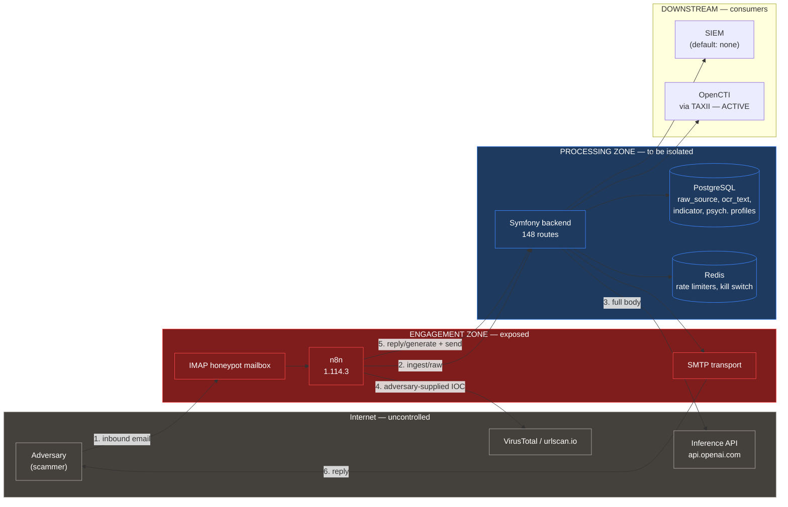

# Phase 1 — Target framework and threats

> Statuses: `[VERIFIED]` read in a file (path + line). `[INFERRED]` inference,
> with the reasoning stated. `[UNKNOWN]` not determinable. `[UNSOURCED]` regulatory
> requirement whose source has not been verified (R4).
>
> **Method note on R4.** Part A below compares *deployment frameworks*. It names
> legal regimes in order to place who authorises and who answers, but **draws no
> normative conclusion from them**: every reference carries the mark
> `[TO BE SOURCED — 1B]`. Text-by-text verification, with article and version, is
> the subject of Part B, carried out once the pilot scenario has been
> validated.

---

## A. Three deployment scenarios

### Factual reminders from phase 0 that constrain the three scenarios

These facts are not reopened; they are taken from `audit/00_inventory.md`.

| Fact | Phase 0 reference |
|---|---|
| The system replies by email to adversaries, under a **fictitious operator identity** | §1.10, `ReplyHandler.php:126` → `SendEmailController.php:47`; personas `PersonaFixtures` (27) |
| Engagement is **inbound only**: a reply presupposes a received message | §4.5 D50 "Lock A" (`ReplyHandler.php:168-186`), `DISCLAIMER.md:12` |
| Inference by default goes out to **`https://api.openai.com`** | §2.1 E1, `.env.dist:307`; 7 call sites **hard-code** an OpenAI model (§3.2) |
| Embeddings go out to OpenAI, **hard-coded endpoint, no abstraction** | §2.1 E4, `EmbeddingService.php:20,68` |
| The **IOC values supplied by the adversary** are submitted to urlscan.io and VirusTotal | §2.3 E23–E25, `WF-EXTRACT-AND-ENRICH-IOC.json:114` |
| **No egress allowlist, no outbound proxy, a single Docker network** | §2.6, `framework.yaml:17-18`, `docker-compose.yml:261-262` |
| The raw RFC822 body of third-party emails is **kept in full** | §7.2, `Message.php:23-24`, `IngestHandler.php:180` |
| **Psychological profiles of third parties** generated by an LLM are persisted, **with no purge** | §7.2, §7.7, `Version2026070600000000.php:29-36` |
| The 6/12-month retention is **not scheduled**; the automatic purge deletes nothing physically | §7.6, `scheduler.sh:16-24` vs `PurgeService.php:25,55` |
| **No anonymisation exists** in the purge path | §7.7 |
| The audit log is **HMAC-chained but not immutable**: the `REVOKE` is neither applied nor documented | §8.9, `Version2026041200100000.php:20-24`, `rg REVOKE docs/` → ∅ |
| The audit HMAC key is a **plaintext environment variable** | §6.1, `AuditHmacChainer.php:19-20` |
| **12 controllers out of 145 emit an audit record**; 4 of the 6 export surfaces emit none | §8.7 |
| **Export blocking for financial IOCs** with release by analyst verdict — a real, working control | §4.8 D66–D73 |
| **No git tag, no release process, public history overwritten** (10 commits, 6 days) | §0, §9.11 |
| **A single maintainer**; MIT licence with no warranty | §0, `LICENSE`, `GOVERNANCE.md:5` |
| No SBOM published beyond a 30-day CI artefact; **no image pinned by digest** | §9.7, §9.8, §10.3 |
| Real pace: human email traffic — the rate limiters cap at **50 conversations/day, 200 LLM calls/hour** | §4.5 D44 |

---

### S1 — Law-enforcement investigation unit, self-hosted

**Description.** An investigation service (criminal police, gendarmerie, national
specialist unit) deploys ScamBuster on its own infrastructure to engage scammers
who solicit honeypot mailboxes, extract IOCs from them and feed criminal
proceedings.

| Dimension | Analysis |
|---|---|
| **Who authorises engagement** | A judicial authority, not the technical operator. In France, exchanging under an assumed identity with a suspected person falls under the **investigation under pseudonym** regime [TO BE SOURCED — 1B], which restricts the act to officers individually **cleared and assigned**, under the authorisation and supervision of the prosecutor or the judge. [INFERRED] The hard point is not technical: the code carries out the investigative act **with no officer in the loop**. Reasoning: the n8n pipeline `WF-INTAKE → WF-REPLY-GENERATE → WF-REPLY-SEND` chains reception, generation and sending with no human stop point (§1.10), and `/send-email` is guarded only by `reply:generate` — the same permission as generation (§12 Q8, `SendEmailController.php:48`). Individual clearance has no counterpart in the permission model (14 permissions, `Permission.php:19-40`), which distinguishes neither the cleared officer nor case-by-case authorisation |
| **Who bears legal liability** | The State, through the service and its head of service; the officer for the investigative act. The publisher is outside the chain: `LICENSE` (MIT) and `DISCLAIMER.md:43-45` exclude any warranty |
| **Which authority accredits** | Security accreditation internal to the ministry, granted by the system's designated authority; State instructions and frameworks [TO BE SOURCED — 1B]. If the system is attached to a vital-importance perimeter, the national information systems security authority steps in [TO BE SOURCED — 1B] |
| **Deliverable expected from the publisher** | A complete accreditation file: formal risk analysis, exhaustive description of flows and zones, **proof that the enforceable controls are deterministic**, chain of evidence for the artefacts, SBOM, commitment to fix vulnerabilities, supported versions. [VERIFIED] None of these deliverables exists: no tag and no version (§0), no published SBOM (§9.8), no supported-versions policy beyond `SECURITY.md:5-7` ("main \| Yes") |
| **Breaking point specific to S1** | **Evidentiary value.** The audit log is HMAC-chained but remains physically modifiable: the `REVOKE UPDATE/DELETE` is explicitly deferred to an operations step (`Version2026041200100000.php:20-24`) that is **documented nowhere** (§8.9, DOC-23), and the HMAC key is an environment variable readable by the very process that writes the rows (§6.1). [INFERRED] An operator with access to the container can rewrite a row **and** recompute the chain: what you get is detection of accidental tampering, not evidence that holds against the operator itself. Reasoning: `AuditHmacChainer.php:19-20` reads `AUDIT_HMAC_KEY` from the application process environment, and `VerifyAuditChainCommand` recomputes with that same key |

---

### S2 — NIS2-regulated essential entity, self-hosted

**Description.** An entity subject to NIS2 as an essential entity (energy,
transport or health operator, bank, digital infrastructure provider) deploys
ScamBuster in its own SOC/CERT, on its own honeypot mailboxes, to produce
intelligence on the campaigns targeting it and to feed its SIEM and its
sector-level sharing.

| Dimension | Analysis |
|---|---|
| **Who authorises engagement** | The entity itself. NIS2 places responsibility for approving and monitoring risk management measures on the **management body** [TO BE SOURCED — 1B]. Engagement is part of defending the entity's information system, not a criminal investigative act: no judicial clearance is required. [INFERRED] This is the structuring difference with S1 — the authorisation is an act of internal governance, which the system can express (analyst verdict, log, kill switch), and not a named clearance that the code does not model |
| **Who bears legal liability** | The entity, alone and unambiguously, on two cumulative grounds: controller within the meaning of the GDPR for the personal data of third parties ingested [TO BE SOURCED — 1B], and essential entity under NIS2 for the security of the system itself. `DISCLAIMER.md:13` explicitly places that capacity on the operator: "You are the data controller" |
| **Which authority accredits** | **No prior external accreditation.** The regime is one of supervision: risk management measures under the entity's responsibility, *a posteriori* review by the competent national authority [TO BE SOURCED — 1B]. What is expected is a **formalised internal risk acceptance**, enforceable in the event of an inspection, not a prior approval |
| **Deliverable expected from the publisher** | A documented and verifiable product, not a warranty: SBOM per version, supported-versions and vulnerability-fixing policy, accurate and up-to-date description of the controls (what each one does **and does not** cover), the ability to run without depending on an external inference API, and evidence usable by the entity's SIEM. [INFERRED] This deliverable is **of the same nature** as what the project already produces — what is missing is the publishing discipline, not the substance. Reasoning: the controls exist and are tested (83 deterministic controls listed in §4, 572 backend tests in §9.1, the GUARD gate in §5.1); what is missing is a tag, an SBOM attached to that tag, and documentation that does not contradict the code on 24 points (§11) |
| **Breaking point specific to S2** | **Inference sovereignty** and **zoning**. The full content of third-party emails leaves for an inference provider outside the entity's zone (§2.1 E1, E4) with no egress allowlist in place (§2.6); seven call sites hard-code an OpenAI model (§3.2); the embeddings have **no provider abstraction** (`EmbeddingService.php:20`). [INFERRED] An essential entity can accept that transfer by contract, but it cannot *demonstrate* that it controls it: nothing in the code makes it possible to guarantee that no content leaves, since `LLM_PROVIDER=ollama` reroutes neither the embeddings nor the urlscan/VirusTotal enrichments of the n8n workflow |

---

### S3 — Node in a federated observatory operated by third parties

**Description.** Several organisations each run a ScamBuster node and pool their
IOCs, clusters and TTPs through TAXII/STIX in a shared observatory.

| Dimension | Analysis |
|---|---|
| **Who authorises engagement** | Each node operator for its own node, under a federation charter. [INFERRED] No authority can authorise engagement for the whole: the federation shares **outputs**, not acts |
| **Who bears legal liability** | **Ambiguous, and that is the central problem.** Each node is controller for what it ingests, but pooling IOCs that contain personal data of third parties (addresses, IBANs, phone numbers — §7.2, `indicator` table) raises a question of joint controllership between nodes [TO BE SOURCED — 1B]. [INFERRED] The code gives no handle on this point: the `indicator` table has **no purge** (§7.7), and an IOC exported to the federation becomes unrecoverable — there is no originating node identifier, no retraction mechanism, and no feed signature |
| **Which authority accredits** | None. A trust framework would have to be built: node certification, node identity, feed signing and provenance, exclusion procedure |
| **Deliverable expected from the publisher** | Everything S2 asks for, **plus**: node identity and attestation, signed IOC provenance, reproducible builds, multi-tenancy, and governance that survives one person. [VERIFIED] The project has one maintainer (`git shortlog -sne`: 2 identities, one person), with no tag and no release process (§9.11), and the only multi-tenant artefact in the code has been **removed** (`Version2026041112000000.php:35` — `ALTER TABLE app_users DROP COLUMN tenant_id`) |
| **Breaking point specific to S3** | **Feed poisoning** and **end-to-end integrity**. IOCs are enriched by submitting the adversary-supplied value to urlscan.io and VirusTotal (§2.3 E23–E25): an adversary who has worked out the automation picks his IOCs so as to steer the enrichment, therefore the clustering, therefore what the whole federation receives. [VERIFIED] The only human filter that exists, the financial export block (§4.8), covers only **10 financial types** — domains, URLs, IPs and email addresses, that is, the bulk of the CTI feed, leave **without an analyst verdict** |

---

### Comparison table

| Criterion | **S1 — Law enforcement** | **S2 — NIS2 essential entity** | **S3 — Federated observatory** |
|---|---|---|---|
| Authorises engagement | Judicial authority, individually named cleared officer | The entity's management body | Each node operator, under a charter |
| Nature of the authorisation | **Individual clearance per act** — not modelled in the code | **Internal governance** — can be modelled with what exists | **Contractual** — with no technical effect |
| Bears liability | State / service / officer | **The entity, alone and unambiguously** | **Distributed, joint controllership unresolved** |
| Accredits | Ministerial designated authority, prior accreditation | **No external accreditation**; internal risk acceptance, *a posteriori* review | None; a trust framework to be created *ex nihilo* |
| Deliverable required from the publisher | Accreditation file, proof of determinism, chain of evidence | **SBOM, supported versions, accurate docs, local inference, SIEM evidence** | All of S2 + node identity, signed feeds, multi-tenancy, multi-person governance |
| Hardest gap | **Evidentiary value** of the log (§8.9) and no cleared human in the loop | **Inference sovereignty** (§2.1) and zoning (§2.6) | **Feed poisoning** (§2.3) and inter-node integrity |
| Nature of the dominant gap | **Institutional** — software cannot produce the clearance | **Technical and bounded** | **Institutional + technical**, combined |
| Compatible with a single maintainer | No — requires a support commitment | **Yes** — the entity takes on operations | No — the federation depends on the publisher's longevity |
| Is the existing financial export block (§4.8) enough? | No — per-act traceability is needed | **Yes for the class it covers**, to be extended | No — 10 types covered out of ~36 |
| Do the artefacts produced serve the other scenarios? | Over-specified for S2/S3 | **Yes — a common subset of S1 and S3** | Over-specified, unreachable first |

---

### Recommendation: **S2, NIS2-regulated essential entity, self-hosted**

Five arguments, in order of strength.

**1. It is the only scenario whose authorisation chain does not ask software for
what software cannot produce.** S1 requires an individually cleared officer to
carry the act of engagement. [INFERRED] No technical change creates a clearance:
at best you add a human approval gate — which the pipeline does not have today
anyway (§12 Q8) — but the obstacle is the standing of the person, not the
existence of the gate. In S2, the authorisation is an act of internal governance,
and that the system does know how to express: analyst verdict
(§4.8 D71), kill switch (§4.5 D47), chained log (§8.3).

**2. Liability there rests with a single party, so it is enforceable.** S2 makes
the entity the sole controller. S3 leaves open a question of joint controllership
between nodes over the personal data of third parties, even though the
`indicator` table has **no purge** (§7.7) and no retraction mechanism
exists. [INFERRED] Dealing with sovereignty and retention is already demanding;
adding an unresolved joint controllership question would make the gap
analysis undecidable, since the obligation itself would be indeterminate.

**3. The S2 gaps are technical and bounded; those of S1 and S3 are
institutional.** The three hard points of S2 — inference sovereignty, zoning of
the engagement layer, log immutability — are design work whose scope can be
measured from the code: 7 hard-coded model sites (§3.2),
1 embedding service with no abstraction, 2 external enrichment n8n nodes,
1 `REVOKE` step not applied. The evidentiary value required by S1 and the trust
framework required by S3 are not software design work.

**4. The scenario is compatible with the reality of the project.** [VERIFIED] One
maintainer, no tag, public history overwritten over 6 days, MIT licence with no
warranty. S1 and S3 both assume a publisher that commits: support, fixes within a
deadline, longevity. S2 is the only one where **the operator takes on
operations** and where the publisher only has to deliver a documented and
verifiable product.

**5. S2 is a subset, not a detour.** SBOM per version, supported-versions
policy, local inference, immutable log, chain of evidence through to the
SIEM, accurate documentation: these deliverables are required by S2 **and** are
prerequisites for S1 and S3. [INFERRED] Choosing S2 closes no doors; choosing S1
first would mean building a judicial chain of evidence before settling the
question of whether email content leaves the entity's perimeter —
that is, hardening the evidence of a flow whose lawfulness is not yet established.

**Explicit reservation.** S2 does not remove the non-technical blockers; it
reduces them to a tractable set. Three remain and are analysed in Part C:
the legal basis for processing the personal data of third parties appearing in
the exchanges, the use of synthetic identities by an entity bound by a fairness
obligation, and escalation risk. [INFERRED] These three points do not depend on
the scenario chosen: they exist identically in S1 and S3, where they add to the
obstacles specific to those frameworks.

---

### What I could not verify — Part A

1. Does the current production deployment already fall under one of these three
   frameworks, or under a fourth — academic research, individual operation — whose
   obligations differ?
2. Is the current operator itself a regulated entity, or a natural person
   acting for research purposes?
3. In which jurisdiction are the production honeypot mailboxes hosted, and
   in which is the operator established?
4. Is the third-party deployer targeted by this audit identified, or is the need
   generic?
5. Is there a support commitment or a service contract envisaged between the
   publisher and a deployer, which would change how the deliverables are split?
6. Are the honeypot mailboxes addresses created from scratch, or addresses
   that once belonged to real people — which would change the nature of the data
   received?
7. Is the real volume of simultaneous conversations in production close to the
   configured caps (50 active conversations/day, `rate_limiter.yaml:38-41`) or
   an order of magnitude below?
8. Has a data protection impact assessment actually been carried out and
   approved, or has `docs/09_dpia_template.md` remained at
   template stage — its filename contains "template"?
9. Have artefacts produced by the system already been passed to an authority,
   a CERT or a third party, and in what form?
10. Is TAXII sharing enabled in production (`TAXII_API_KEY` has an empty default,
    `.env.dist:396`), and if so, with which recipients?
11. Has the operator already received a complaint, an access request or a
    challenge from a data subject appearing in the exchanges?
12. Must the pilot scenario be chosen for a French deployer, a European one, or
    with no jurisdiction assumption — which directly determines the list of
    applicable frameworks in Part B?

---

---

## Framing settled after STOP 1

| Parameter | Value adopted | Origin |
|---|---|---|
| Pilot scenario | **S2 — NIS2-regulated essential entity, self-hosted** | Chosen at the end of the Part A comparison |
| Jurisdiction | **EU, with no national assumption** | Answer A1 |
| Web access for sourcing | **Allowed** | Answer A2 |
| Subject of the audit | **The configuration shipped by default** (`.env.dist`, `docker-compose.prod.yml`, documentation) — what a third-party deployer gets, and not any particular deployment | The mandate covers deployment by a third party in a regulated environment |
| Human validation before sending | **Absent from the shipped pipeline** | `WF-REPLY-GENERATE-V2.json` chains into `WF-REPLY-SEND-v1.json` with no stop point; `SendEmailController.php:48` carries the same permission as generation |
| TAXII dissemination | **Shipped and documented path** to an external CTI platform | `src/Application/Taxii/TaxiiService.php`, 4 TAXII controllers, `docs/11_opencti_integration.md` |
| Purge, budget, SIEM export | Treated as **specification decisions** bearing on the shipped default values | Consequence of the refocus on the shipped configuration |
| Audit locking, honeypot lists, safe domain list | Treated as **product gaps**: for a third-party deployer, the shipped default is what counts | Consequence of the refocus |

---

## B. Frameworks applicable to scenario S2

> Every row cites its legal source with article and version (R4). Frameworks with
> no verified source are marked `[UNSOURCED]` and excluded from the analysis.
> **Environment limitation to flag:** all the primary and near-primary sources of
> the text — `eur-lex.europa.eu`, `artificialintelligenceact.eu`,
> `ai-act-service-desk.ec.europa.eu`, and five other collections — are unreachable
> from this environment, **by any route**: the fetch tool refuses them
> and a direct call returns HTTP code 000, that is, a connection failure at
> network level. The wording of Article 50(1) reproduced below was therefore
> **confirmed word for word by two independent searches**, one of them bearing
> specifically on the exemption clause and establishing that it belongs to
> paragraph 1. It still has to be confirmed against the Official Journal of the
> European Union by a reader with unfiltered access — it is the only verification
> left in the whole audit that bears on its gap no. 1.

### B.1 Applicable and enforceable

| # | Framework | Source + version | Status | Reason |
|---|---|---|---|---|
| **N1** | **Regulation (EU) 2024/1689 ("AI Act"), Art. 50(1)** — transparency of systems interacting directly with natural persons | Regulation (EU) 2024/1689. Art. 50 **applicable since 2 August 2026**. Commission guidelines on Art. 50 published on **20 July 2026** | **APPLICABLE — and decisive** | See B.2 |
| **N2** | **Directive (EU) 2022/2555 ("NIS2"), Art. 20** — the management body approves the measures, oversees their implementation and **can be held liable** for failures | Directive (EU) 2022/2555, Art. 20 | **APPLICABLE** | Grounds the engagement authorisation in S2: it is an act of governance, which is what separates S2 from S1 |
| **N3** | **NIS2, Art. 21(1) and 21(2)** — appropriate and proportionate technical, operational and organisational measures; **10 minimum measures**, technology-neutral and outcome-oriented | Directive (EU) 2022/2555, Art. 21 | **APPLICABLE** | Grounds the requirements on risk management, supply chain security, incident handling and logging |
| **N4** | **NIS2, Art. 23** — incident notification obligations | Directive (EU) 2022/2555, Art. 23 | **APPLICABLE** | See Part C |
| **N5** | **GDPR, Regulation (EU) 2016/679, Art. 6(1)(f)** — legitimate interest | Regulation (EU) 2016/679 | **APPLICABLE** | The most plausible legal basis for S2; requires a balancing test, see C2 |
| **N6** | **GDPR Art. 9** — special categories of data | Regulation (EU) 2016/679 | **APPLICABLE** | The raw email body and the OCR of attachments can contain Art. 9 data, with nothing to detect or strip it (§7.2) |
| **N7** | **GDPR Art. 14(1), 14(2), 14(5)(b)** — informing individuals when the data was not collected from them; the **disproportionate effort** exception, strictly interpreted, coupled with appropriate measures including making the information publicly available | Regulation (EU) 2016/679, Art. 14 | **APPLICABLE** | Concerns the **third parties named in the exchanges** (victims, mules, bank accounts), not only the scammer |
| **N8** | **GDPR Art. 35** — data protection impact assessment | Regulation (EU) 2016/679, Art. 35 | **APPLICABLE** | Systematic large-scale processing, profiling, vulnerable people → DPIA required |
| **N9** | **Regulation (EU) 2024/2847 ("CRA")** — products with digital elements | Regulation (EU) 2024/2847. Entry into force **10 December 2024**; **obligations to report actively exploited vulnerabilities and severe incidents from 11 September 2026**; full application **11 December 2027** | **APPLICABLE TO THE PUBLISHER — to be confirmed on the exemption** | The CRA provides an exemption for non-commercial free software and creates the notion of an **"open source steward"**. ScamBuster's exact status depends on whether it is made available on the EU market. **The first milestone falls in one month** |

### B.2 The decisive point — AI Act Art. 50(1)

**Wording** [VERIFIED — wording confirmed by two independent searches; primary
source unreachable from this environment, see the method note above]:

> "Providers shall ensure that AI systems intended to interact directly with natural
> persons are designed and developed in such a way that the natural persons concerned
> are informed that they are interacting with an AI system, unless this is obvious
> from the point of view of a natural person who is reasonably well-informed,
> observant and circumspect, taking into account the circumstances and the context of
> use. **This obligation shall not apply to AI systems authorised by law to detect,
> prevent, investigate or prosecute criminal offences**, subject to appropriate
> safeguards for the rights and freedoms of third parties, unless those systems are
> available for the public to report a criminal offence."

Three findings follow on from one another.

**1. The obligation falls on the *provider*, not on the operator.** Article 50(1)
targets *providers* and requires the system to be "designed and developed" so as
to inform. [INFERRED] The addressee of this obligation is therefore **the
ScamBuster publisher**, not the third-party deployer: it is a design requirement,
not a configuration one. Reasoning: the verb bears on design and development, and
the marking obligation belongs to the provider where the obligation to disclose to
end users belongs to the deployer (guidelines of 20 July 2026).

**2. The exemption does not cover S2.** It is reserved for systems "authorised by
law to detect, prevent, investigate or prosecute criminal offences". [INFERRED] A
NIS2 essential entity under private law — a bank, an energy company, a health
operator — is not authorised by law to investigate criminal offences; it defends
its own information system. The exemption targets the S1 framework, precisely the
one we ruled out. Reasoning: the exemption is written around the status of the
system under criminal law, not around the defensive purpose of its operator.

**3. The code actively enforces the opposite of the obligation.** [VERIFIED]
`PolicyGuard::FORBIDDEN_PATTERNS` (`src/Application/LLM/PolicyGuard.php:47-54`) blocks
a reply containing `/\bI am (?:a |an )?(?:bot|automated|AI)\b/i`,
`/\bautomated system\b/i` or `/\bartificial intelligence\b/i`. The non-overridable
CORE prompt rule forbids any awareness of the automated nature
(`BasePromptRules.php:41`), and the GUARD oracle treats self-disclosure as a
**violation** that must fail (`SafetyInvariantOracle.php:153-165`, code
`automation_reveal`, gated).

[INFERRED] **This is a head-on contradiction between the product and an obligation
that has applied for nine days, and it is not configurable:** it is not a
setting left to the operator but an invariant that three independent mechanisms —
a deterministic guardrail, a prompt rule declared non-overridable, and a
non-regression gate — are designed to preserve. Reasoning: the three
mechanisms cited treat self-disclosure as a defect to be fixed, which is
the exact opposite of the Art. 50(1) requirement.

This contradiction is **not** an implementation defect: it is constitutive
of the product. It is carried into Part C as the rank 1 blocker and will be the
subject of the most serious gap of phase 2.

### B.3 Applicable as engineering references, not enforceable

| # | Framework | Source + version | Status |
|---|---|---|---|
| R1 | **OWASP GenAI — LLM Top 10, 2026 edition** | OWASP GenAI Security Project, published on **4 August 2026**; "Prompt Injection" and "Sensitive Information Disclosure" remain in the top two places | **Engineering reference** — not normative, with no enforceable value |
| R2 | **OWASP Top 10 for Agentic Applications (ASI)** | OWASP GenAI Security Project, first published **December 2025** | **Engineering reference**, more relevant than R1 for this system: there the model is an actor with tools and downstream consequences, which describes exactly the reply and export pipeline |
| R3 | **MITRE ATLAS** | MITRE knowledge base of adversarial tactics and techniques against AI systems. Version not pinned in this audit | **Engineering reference** — used as the naming scheme in Part D |
| R4 | **ISO/IEC 42001:2023** — AI management system | Published in **December 2023**; still the current version in August 2026 | **Applicable voluntarily or by contractual requirement** — not enforceable in itself |
| R5 | **ISO/IEC 27001:2022 + Amd 1:2024** | Amendment 1 published in **February 2024** ("Climate action changes"), auditable since May 2024 | **Applicable voluntarily or by contractual requirement** — often required by an essential entity of its suppliers, without being imposed by NIS2 |
| R6 | **NIST AI RMF** | Voluntary NIST framework, of US origin. **Version and publication reference not confirmed from this environment** | `[PARTLY SOURCED]` — **kept as vocabulary only**, excluded as a source of requirements |

### B.4 Not applicable — explicitly ruled out

| # | Framework | Source + version | Reason for exclusion |
|---|---|---|---|
| X1 | **LPM 2013 Art. 22 and the code de la défense (OIV/SIIV regime)** | French national regime | **RULED OUT.** National regime, reserved for operators of vital importance **designated by ministerial order**. The scope adopted is "EU with no national assumption" (A1), and nothing indicates that the target deployer is a designated OIV. Reintroducing this framework would require fixing the jurisdiction **and** the designation |
| X2 | **ReCyF — Référentiel Cyber France** | ANSSI, **working version 2.5 of 17 March 2026**, 20 security objectives | **RULED OUT.** French national framework implementing NIS2. Not applicable to a generic EU scope. It would become applicable again if the target deployer were French — and it is the best candidate for that, which justifies keeping it in documentary reserve rather than forgetting it |
| X3 | **SecNumCloud** | ANSSI qualification for cloud hosting providers, version 3.2 `[PARTLY SOURCED]` | **RULED OUT on two cumulative grounds**: a French national qualification, and a qualification of a **cloud computing provider** whereas S2 is a deployment **self-hosted** by the entity. Moot here |
| X4 | **EBIOS Risk Manager** | ANSSI method, published in 2018, updated in 2024 `[PARTLY SOURCED]` | **RULED OUT as an enforceable framework** — it is a risk analysis method, not a body of requirements. **Kept as a method**: Part D borrows its risk-source and attack-path logic, alongside STRIDE |
| X5 | **Digital evidence rules** | — | **RULED OUT for S2.** Evidentiary value before a criminal court is the structuring constraint of S1, ruled out at STOP 1. In S2 the purpose is defensive intelligence and feeding a SIEM, not building evidence. **Reservation:** integrity and traceability are still required, but under NIS2 Art. 21(2) and not under an evidentiary regime — so the requirement is a "reliable and auditable log", not "evidence that holds in court". This distinction downgrades several gaps that S1 would have made blocking |

### B.5 Actual status of the French transposition of NIS2

A question explicitly raised in the brief, handled even though it is not
decisive for the scope adopted.

| Fact | Date |
|---|---|
| Transposition deadline set by the directive (Art. 41) | **17 October 2024** — missed by France |
| Reasoned opinion from the European Commission to France for failure to notify full transposition | **7 May 2025** |
| Adoption by the Senate, first reading, of the bill on the resilience of critical infrastructure and the strengthening of cybersecurity | **12 March 2025** |
| Adoption of an amended text by the special committee of the National Assembly | **10 September 2025** |
| Debate in public session | scheduled for **July 2026**, subject to an extraordinary session |
| **Status as of 6 August 2026** | **Transposition not complete; no transposition law enacted** |
| Announced scope | ANSSI designated as national authority; about **15 000 entities** vs ~500 under NIS1 |

[INFERRED] Consequence for the audit: a **French** deployer is not yet
legally subject to the NIS2 obligations under domestic law, but will be, and the
transposition text is settled on the essentials. A deployer in another Member State
that has transposed is already subject to them. The scope adopted — EU with no
national assumption — therefore leads to treating NIS2 as **applicable through the
transposition of the deployer's Member State**, without depending on the French
timetable. Reasoning: the directive binds the Member States as to the result; the
product requirement that follows is identical whatever the
transposing State.

---

## C. Non-technical blockers, ranked by severity

Three qualifications, as requested: **blocking**, **can be worked around by narrowing scope**,
**outside technical reach**.

### C1 — Transparency obligation about the artificial nature of the system
**Severity: BLOCKING. Rank 1.**

| Item | Content |
|---|---|
| Legal source | Regulation (EU) 2024/1689, Art. 50(1), applicable since 2 August 2026 |
| Who is bound | **The publisher**, as provider: a design and development obligation |
| What the code does | Three independent mechanisms enforce the opposite: `PolicyGuard.php:47-54` (6 blocking patterns), `BasePromptRules.php:41` (non-overridable CORE rule), `SafetyInvariantOracle.php:153-165` (`automation_reveal` violation watched by the GUARD gate) |
| Does the exemption apply? | **Not in S2.** Reserved for systems authorised by law to detect, prevent, investigate or prosecute criminal offences — that is the S1 framework |
| Qualification | **Blocking, and cannot be worked around by narrowing scope.** Narrowing the scope does not remove the direct interaction with a natural person: that is the very function of the product |
| What remains open | The clause "unless this is obvious […] to a reasonably well-informed, observant and circumspect natural person" is the only line of argument. [INFERRED] It is weak here: the product is explicitly designed so that it is **not** obvious — that is the purpose of the 36 politeness formulas removed by `SignatureStripper` and of the contextual length bands in `PolicyGuardConfig` |

[INFERRED] This is the only blocker in the whole audit that calls into question the
**viability of the product** in the chosen scenario, rather than its engineering
quality. Reasoning: all the other gaps can be fixed by design work; this one sets a
design obligation against the constitutive function of the system.

### C2 — Legal basis for processing the personal data of third parties
**Severity: BLOCKING as it stands, can be worked around by narrowing scope.**

Two populations must be distinguished, which the code does not do.

| Population | Analysis |
|---|---|
| **The scammer** | Legitimate interest (Art. 6(1)(f)) is defensible: security of the entity's information system, fraud prevention. The balancing test leans towards the controller |
| **The third parties named in the exchanges** — victims, mules, bank account holders, people mentioned in attachments | [VERIFIED] This data is collected on a massive scale: `message.raw_source` keeps the full RFC822 (`Message.php:23-24`), `attachment.ocr_text` the OCR'd text (`:41-42`), the `indicator` table the IBANs, phone numbers and addresses (§7.2). **The Art. 6(1)(f) balancing test has not been done for them**, and the Art. 14 information is not given to them |
| Art. 9 data | [VERIFIED] Nothing in the code detects or strips health, opinion or orientation data present in an email body or an OCR'd attachment. `MessageAnonymizer` (`:23-37`) masks 5 patterns — email, IBAN, BTC, ETH, phone — and **only for prompt building**, never for storage |
| Working around it by narrowing scope | **Yes, partly.** The financial export block (§4.8 D66–D73) is already the start of the right move: it holds the 10 financial types behind a human verdict. Extending that logic to the "contact" types and putting minimisation in place at ingestion would reduce the population of third parties concerned |
| Qualification | **Blocking as it stands** — a third-party deployer cannot document its legal basis for this population. **Can be worked around by narrowing scope** — it is bounded design work, handled in phase 3 |

### C3 — Use of synthetic identities
**Severity: can be worked around by narrowing scope. Downgraded compared with S1.**

[INFERRED] In S1 this point was structuring: the use of an assumed identity by a
public body facing a suspected person falls under a clearance regime.
In S2, the operator is a private entity defending its own system: no
public-authority capacity is engaged, and `DISCLAIMER.md:21` already limits use
to **fictitious** identities configured by the operator, with no impersonation of
real people or organisations.

What remains: the **fairness** principle of processing (GDPR Art. 5(1)(a))
combines with C1. [INFERRED] Once C1 is dealt with — the other party knows they are
talking to an AI system — the fairness objection loses most of its force. The two
points must therefore be handled together, and C3 has no solution of its own.

One control is left to verify rather than build: [VERIFIED] `PolicyGuard`
`AUTHORITY_PATTERNS` (`:94-122`, 22 patterns in 5 languages) already blocks
authority impersonation — police, courts, banks, tax administration. **Qualification:
can be worked around by narrowing scope**, provided C1 can be.

### C4 — Escalation risk and liability
**Severity: partly outside technical reach.**

| Aspect | Qualification |
|---|---|
| The adversary discovers the automation and turns against the operator | **Outside technical reach** for the "turns against" part; **in scope** for the "discovers" part — see threat T1 in Part D |
| The adversary redirects the engagement towards a real victim | **Can be worked around by narrowing scope.** Existing control: `OUT_OF_BAND_CHANNEL_PATTERNS` (`:159-197`, 9 patterns) stops the persona from giving out an alternative channel. **Not covered**: nothing stops the persona from *receiving* and *processing* the contact details of a real victim passed on by the scammer |
| The system instigates a payment | **Already handled, partly.** `PaymentInstigationGuard` (S1/S2 in part 5) with a deterministic 12-token fallback. **Not covered**: free paraphrase during an LLM outage (§5 S1) |
| The operator's civil liability towards an injured third party | **Outside technical reach.** A matter for insurance and the contractual framework |
| No human validation before sending | **Blocking, and in scope.** [VERIFIED] The shipped pipeline chains generation and sending with no stop point (`WF-REPLY-GENERATE-V2.json` → `WF-REPLY-SEND-v1.json`); `/send-email` is guarded only by `reply:generate` (`SendEmailController.php:48`), the same permission as generation. A regulated deployer cannot demonstrate control over the act of engagement |

### C5 — Evidentiary value of the artefacts
**Severity: downgraded in S2 — can be worked around by narrowing scope.**

[INFERRED] In S1 this was the breaking point. In S2, the purpose is not evidentiary:
the artefacts feed a SIEM and CTI sharing. The applicable requirement becomes
that of NIS2 Art. 21(2) — reliability, traceability, integrity — and not an
evidentiary regime. Reasoning: X5 in Part B rules out digital evidence rules for this
scenario.

What is still required, and is not met: [VERIFIED] the audit log is
HMAC-chained but the `REVOKE UPDATE/DELETE` is deferred to an operations step
that is **not documented** (`Version2026041200100000.php:20-24`; `rg REVOKE docs/` → ∅), the
HMAC key is an environment variable readable by the writing process
(`AuditHmacChainer.php:19-20`), and **12 controllers out of 145 emit an audit record** — including
none of the deletion controllers, nor 4 of the 6 export surfaces (§8.7).
**Qualification: can be worked around by narrowing scope**, bounded design work.

### C6 — Notification obligations
**Severity: can be worked around by narrowing scope, with a near deadline.**

| Legal source | Obligation | Status |
|---|---|---|
| NIS2 Art. 23 | Notification of significant incidents to the competent authority | An **operator** obligation. The publisher must supply what is needed to meet it: detection, reliable timestamping, usable export. [VERIFIED] `SIEM_PROVIDER=none` by default (`.env.dist:421`) — the third-party deployer has **no event export active at install time** |
| GDPR Art. 33 and 34 | Breach notification to the authority and communication to the data subjects | An operator obligation. `docs/compliance/breach-notification-procedure.md` exists |
| **CRA, Regulation (EU) 2024/2847** | Reporting of **actively exploited** vulnerabilities and severe incidents | **A publisher obligation, applicable from 11 September 2026** — in one month. [VERIFIED] `SECURITY.md` provides a reporting channel but **no supported-versions policy** beyond "main \| Yes" (`SECURITY.md:5-7`), and there is **no tag and no release** (§0): the publisher cannot identify the version affected by a vulnerability |

### Ranking summary

| Rank | Blocker | Qualification | Handled in phase 3? |
|---|---|---|---|
| 1 | **C1 — AI transparency (Art. 50(1))** | **Blocking, cannot be worked around by narrowing scope** | Yes — it is gap no. 1 |
| 2 | **C2 — legal basis for the third parties named** | Blocking as it stands, can be worked around by narrowing scope | Yes |
| 3 | **C4b — no human validation before sending** | Blocking, in scope | Yes |
| 4 | **C6 — CRA notification on the publisher side** | Can be worked around, deadline of 11 September 2026 | Yes |
| 5 | **C5 — integrity and auditability** | Can be worked around by narrowing scope, downgraded compared with S1 | Yes |
| 6 | C3 — synthetic identities | Can be worked around, with no solution of its own: depends on C1 | Handled with C1 |
| 7 | C4a, C4d — escalation, civil liability | Outside technical reach | No — documented, not built |

---

## D. Threat model of the system itself

Method: **STRIDE** for the naming scheme, complemented by the risk-source and
attack-path logic of **EBIOS RM** (X4). Adversary naming scheme: **MITRE
ATLAS** (R3).

### D.1 Zoning — the working assumption

In line with R6, a full air gap is ruled out: the system's job is to exchange
messages with adversaries over the Internet. The reasoning covers **two zones**.

[VERIFIED] **This zoning does not exist in the shipped configuration.** A single
`scambuster` bridge network (`docker-compose.yml:261-262`), no `internal: true`, no
egress allowlist, no proxy (`framework.yaml:17-18`). Arrows 3 and 4
therefore leave from the zone that should be isolated, straight to the Internet.

### D.2 Threats — STRIDE naming scheme

| ID | Threat | STRIDE | Attack path | Evidence | Existing control | Residual gap |
|---|---|---|---|---|---|---|
| **T1** | **The adversary discovers the automation** | *Information disclosure* | Conversational probing: injecting contradictions, questions about the context, latency tests, an explicit "are you a bot?" | Contextual length bands triggered on a bot accusation (`PolicyGuardConfig.php:70-75`: `12/70` words) — the product anticipates the probing | `FORBIDDEN_PATTERNS` (6 patterns), `SignatureStripper` (36 formulas), `OperationalLeakageDetector` (LLM) | **Pacing is an untreated giveaway**: `MIN_HOURS_BETWEEN_REPLIES = 6` is fixed (`ReplyCadenceService.php:27`) and a "human" delay is computed on the n8n side. No control measures the timing signature across all conversations. **And C1 makes this threat legally obsolete**: if the transparency obligation applies, T1 stops being a threat and becomes a requirement |
| **T2** | **Deliberate poisoning of the IOC feed** | *Tampering* | The adversary, having worked out the automation, picks his IOCs: domains of innocent third parties, IPs of legitimate providers, IBANs of real victims. These values are extracted, normalised, correlated into clusters, then **exported to OpenCTI** | [VERIFIED] Extraction on every inbound message (`IocExtractionPolicy.php:23-26`); TAXII export **active to OpenCTI** (answer B10) | `IocValidator` (IBAN/Luhn/BTC/ETH checksums), private IP filter (**only 4 ranges**), list of 12 free email providers, financial export block with analyst verdict (**10 types**) | **Domains, URLs, IPs and email addresses — the bulk of the CTI feed — leave without a human verdict.** The financial block covers only 10 types out of ~36. An IOC exported to OpenCTI has **neither an originating node identifier nor a retraction mechanism** (§7.7: the `indicator` table has no purge) |
| **T3** | **Enrichment turned into a signalling channel** | *Tampering* / *Information disclosure* | [VERIFIED] `WF-EXTRACT-AND-ENRICH-IOC.json:114` submits **the IOC value supplied by the adversary** to urlscan.io and VirusTotal. An adversary who puts a unique URL in his email and watches the public urlscan submissions **detects the honeypot's existence, when it activates and its pace** | n8n nodes `urlScanIo` and VirusTotal (§2.3 E23–E25) | **None** | **Threat not handled.** It is a side channel for discovering the honeypot, independent of the content of the replies — therefore invisible to PolicyGuard and to the GUARD gate, which only observe outgoing texts |
| **T4** | **Compromise of the engagement zone used as a pivot** | *Elevation of privilege* | n8n `1.114.3` processes unfiltered attachments coming from adversaries, on **the same bridge network** as PostgreSQL and Redis. From a compromised n8n: direct access to the database, to the Redis rate limiters, to the encryption key of its own credential store | [VERIFIED] Single network (`docker-compose.yml:261-262`); **no MIME allowlist** on attachments (`EmailParsingService.php:275`); images not pinned by digest (§10.3); production IMAP/SMTP credentials held by n8n (`check-no-vault-resurrection.sh:5-8`) | `postgres` and `redis` with no published ports in prod (`docker-compose.prod.yml:42,58`); `app` and `n8n` on loopback by default | **No segmentation.** The most exposed component — the one that speaks IMAP to adversaries and downloads their attachments — shares the network with the data store, and holds the production credentials |
| **T5** | **Exfiltration through the LLM channel** | *Information disclosure* | Prompt injection in an inbound email aiming to surface, in the reply sent to the adversary, context from other conversations, honeypot names, or configuration | [VERIFIED] Injection detection is **purely forensic**: "does not block ingestion or modify the reply pipeline" (`PromptInjectionDetector.php:18`); the audit emits a `'blocked'` issue while **nothing is blocked** (`IngestPostProcessor.php:564-577`) | `PromptInjectionPatternMatcher` (25 regexes, **English only**), `OPERATIONAL_LEAKAGE_PATTERNS` (10 tokens), `OperationalLeakageDetector` (LLM, **fails open**) | **The detector targeting paraphrase fails open and has no deterministic safety net** (§5 S3). The 25 injection patterns are English-language while the corpus is multilingual (EN/FR/DE/ES fixtures). Homoglyph normalisation **degrades silently if the intl extension is missing** (`:273-274`) |
| **T6** | **Abuse of the prompt override** | *Tampering* / *Elevation of privilege* | An operator — or a compromised account carrying `config:write` — modifies a prompt through `PUT /api/v1/prompt-overrides/{key}` | [VERIFIED] 6 overridable keys; the override **is concatenated after** the CORE rules, and the code notes it itself: "a hostile override can add text that…" (`PromptBuilder.php:98`) | CORE/EDITABLE split, GUARD canary on a real LLM with comparison to the baseline, `CONFIG_CHANGED` audit | The canary is **asynchronous and optional** (compose profile `canary`, `docker-compose.yml:168`); `CanaryAvailability` cannot see whether the worker is running (`:21-22`). An override can therefore be live before any validation |
| **T7** | **Repudiation by the operator** | *Repudiation* | An operator with access to the container modifies an `audit_log` row **and** recomputes the chain, the key being in his environment | [VERIFIED] `AuditHmacChainer.php:19-20`; `REVOKE` neither applied nor documented | HMAC-SHA256 chain, daily verification (`scheduler.sh:91-97`) | **Detection of accidental tampering, not resistance to the operator.** Downgraded in S2 (C5) but remains a NIS2 Art. 21(2) gap |
| **T8** | **Denial of service through inbound content** | *Denial of service* | Very large email, 25 MB attachment, body triggering catastrophic regex backtracking | Caps `MAX_SCAN_BYTES = 1 MB` (`:79`), `MAX_REGEX_BYTES = 1 MB`, 25 MB attachment, `PayloadSizeLimitListener` | Redis rate limiters (8 limiters, §4.5 D44) | **Handled, and proportionate.** [INFERRED] Against R5 — human email traffic pace, a few messages per minute at peak — the 8 configured rate limiters are amply sized. No over-sizing to fix here; it is the only part of the threat model where what exists is enough |
| **T9** | **Loss of availability of the inference provider** | *Denial of service* | Outage or cut-off of the OpenAI API | [VERIFIED] `OperationalLeakageDetector` and `PaymentInstigationGuard::check()` **fail open** in that case (§5) | Frozen `FallbackProvider` fallback, cap of 3 attempts | **An inference outage degrades the guardrails before it degrades the service**: the two LLM guards open, and only the 12-token fallback remains |
| **T10** | **Supply chain compromise** | *Tampering* | Tampered base image or dependency | [VERIFIED] **No image pinned by digest**; `nginx:alpine` on a floating tag; gitleaks downloaded by tag with no checksum verification (`ci.yml:252-255`); SBOM produced but **never published**, a 30-day CI artefact; no git tag | Trivy CRITICAL/HIGH blocking on 3 images, blocking `composer audit`, monthly dependabot | **NIS2 Art. 21(2) explicitly covers supply chain security.** A deployer can neither identify the version it runs nor obtain its SBOM |

### D.3 What the threat model reveals about the hierarchy

[INFERRED] Three lessons that a control-by-control reading did not give.

**First, T3 is invisible to the whole existing security apparatus.** The
guardrails, the GUARD oracle and the non-regression gate observe **only the texts
coming out of the LLM**. Submitting an adversary IOC to urlscan.io is a network
egress that goes through none of them. Reasoning: `CanaryAggregate.php:29-83` scores only
`out_texts`; the n8n enrichment workflow is not within the backend's scope.

**Second, the fail-open paths line up.** T9 shows that `OperationalLeakageDetector`,
`PaymentInstigationGuard::check()` and the director brief all open on the same
cause — unavailability of the inference provider. [INFERRED] A single outage degrades
three guards at once, and the remaining deterministic fallback is limited to 12
payment-vocabulary tokens. Reasoning: the three classes catch `\Throwable` and
return a permissive value (§5, S1/S3/S6).

**Third, C1 reconfigures T1.** If the Art. 50(1) transparency obligation
applies, the threat "the adversary discovers the automation" stops existing as a
threat: it becomes a design requirement. [INFERRED] A significant part of
the product's security apparatus — `FORBIDDEN_PATTERNS`, `SignatureStripper`, the
oracle's `automation_reveal` code, the contextual bands in `PolicyGuardConfig` —
protects an invariant that the law applicable to the chosen scenario forbids. It is
the most structuring observation of this phase, and it conditions phase 2.

---

## What I could not verify — phase 1

1. The exact wording of Article 50(1) could not be read on EUR-Lex, blocked by the
   egress proxy: the text quoted comes from concordant secondary sources.
   Can someone confirm the wording against the Official Journal of the European Union?
2. Do the Commission guidelines of 20 July 2026 on Article 50
   specify what a disclosure "perceptible within the interaction" is for an
   **asynchronous** channel such as email — header, signature, first line of the body?
3. Has the clause "unless this is obvious […]" received an interpretation that
   could cover an email exchange with a professional scammer?
4. Does Article 50(2), on machine-readable marking of synthetic content,
   apply to a generated email, and if so is the publisher a provider or a
   deployer within the meaning of that provision?
5. Does ScamBuster fall under the CRA free software exemption, or under the
   "open source steward" category, and does that change the 11 September 2026 deadline?
6. Is the target deployer established in a Member State that has completed its
   NIS2 transposition, which would make N2–N4 immediately enforceable?
7. Is the target deployer an **essential** or an **important** entity within the
   meaning of NIS2 — the supervision obligations differ?
8. Is there any data protection authority doctrine on how honeypot
   mailboxes and automated engagement with an unsolicited sender are qualified?
9. Is the sharing to OpenCTI one-way, or does the OpenCTI node redistribute
   to third parties — which would determine whether the S3 joint controllership
   question already arises in fact in S2?
10. Do the IOCs already exported to OpenCTI contain personal data of
    non-scammer third parties, and is there any way to withdraw them after the fact?
11. The versions of MITRE ATLAS and of the NIST AI RMF were not pinned: does that
    affect any requirements I may not have identified?
12. `SecNumCloud` in version 3.2 and `EBIOS RM` updated in 2024: are these
    version references, unconfirmed against an official source, accurate — knowing that
    both are ruled out of scope?
13. The egress proxy of this audit environment blocked three official legal
    sources: were other texts left out of my analysis for that reason
    without my noticing?
14. Is the deploying entity considering qualifying the system as high-risk AI
    under a provision of the AI Act other than Article 50, which would trigger a
    far heavier body of obligations?

---

*End of phase 1.*
