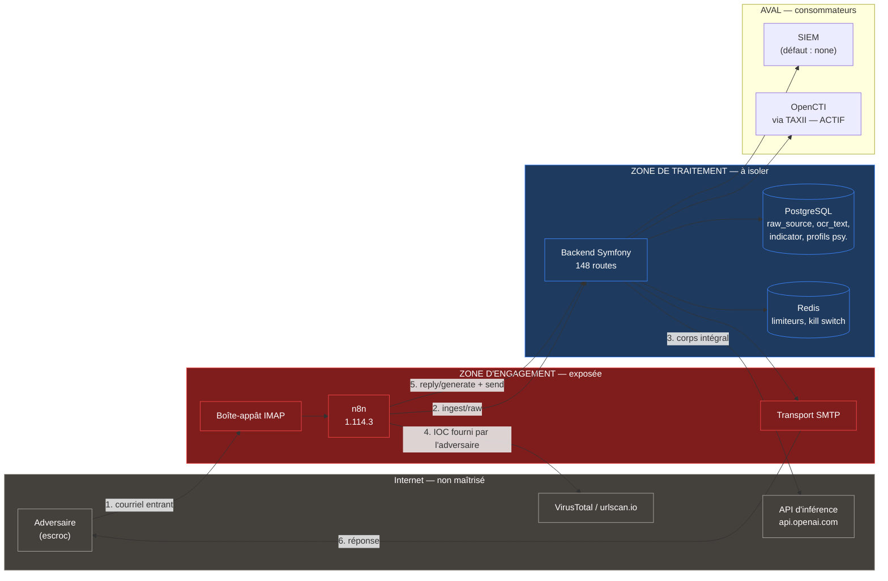

# Phase 1 — Cadre cible et menaces

> Statuts : `[VÉRIFIÉ]` lu dans un fichier (chemin + ligne). `[DÉDUIT]` inférence,
> raisonnement explicité. `[INCONNU]` non déterminable. `[NON SOURCÉ]` exigence
> normative dont la source n'a pas été vérifiée (R4).
>
> **Note de méthode sur R4.** La partie A ci-dessous compare des *cadres de
> déploiement*. Elle nomme des régimes juridiques pour situer qui autorise et qui
> répond, mais **n'en tire aucune conclusion normative** : chaque référence porte
> la marque `[À SOURCER — 1B]`. La vérification texte par texte, avec article et
> version, est l'objet de la partie B, exécutée après validation du scénario
> pilote.

---

## A. Trois scénarios de déploiement

### Rappels factuels de la phase 0 qui contraignent les trois scénarios

Ces faits ne sont pas rediscutés ; ils sont repris de `audit/00_inventory.md`.

| Fait | Référence phase 0 |
|---|---|
| Le système répond par courriel à des adversaires, sous **identité fictive d'opérateur** | §1.10, `ReplyHandler.php:126` → `SendEmailController.php:47` ; personas `PersonaFixtures` (27) |
| L'engagement est **entrant seulement** : la réponse suppose un message reçu | §4.5 D50 « Verrou A » (`ReplyHandler.php:168-186`), `DISCLAIMER.md:12` |
| L'inférence par défaut sort vers **`https://api.openai.com`** | §2.1 E1, `.env.dist:307` ; 7 sites d'appel codent un modèle OpenAI **en dur** (§3.2) |
| Les embeddings sortent vers OpenAI, **endpoint en dur, sans abstraction** | §2.1 E4, `EmbeddingService.php:20,68` |
| Les **valeurs d'IOC fournies par l'adversaire** sont soumises à urlscan.io et VirusTotal | §2.3 E23–E25, `WF-EXTRACT-AND-ENRICH-IOC.json:114` |
| **Aucune liste blanche de sortie, aucun proxy sortant, un seul réseau Docker** | §2.6, `framework.yaml:17-18`, `docker-compose.yml:261-262` |
| Le corps brut RFC822 des courriels de tiers est **conservé intégralement** | §7.2, `Message.php:23-24`, `IngestHandler.php:180` |
| Des **profils psychologiques de tiers** générés par LLM sont persistés, **sans purge** | §7.2, §7.7, `Version2026070600000000.php:29-36` |
| La rétention 6/12 mois **n'est pas planifiée** ; la purge automatique ne supprime rien physiquement | §7.6, `scheduler.sh:16-24` contre `PurgeService.php:25,55` |
| **Aucune anonymisation n'existe** dans le chemin de purge | §7.7 |
| Le journal d'audit est **chaîné par HMAC mais non immuable** : le `REVOKE` n'est ni appliqué ni documenté | §8.9, `Version2026041200100000.php:20-24`, `rg REVOKE docs/` → ∅ |
| La clé HMAC d'audit est une **variable d'environnement en clair** | §6.1, `AuditHmacChainer.php:19-20` |
| **12 contrôleurs sur 145 émettent un audit** ; 4 des 6 surfaces d'export n'en émettent aucun | §8.7 |
| **Blocage d'export des IOC financiers** avec libération par verdict d'analyste — contrôle réel et fonctionnel | §4.8 D66–D73 |
| **Aucun tag git, aucun processus de publication, historique public écrasé** (10 commits, 6 jours) | §0, §9.11 |
| **Un seul mainteneur** ; licence MIT sans garantie | §0, `LICENSE`, `GOVERNANCE.md:5` |
| Aucun SBOM publié hors artefact CI à 30 jours ; **aucune image épinglée par empreinte** | §9.7, §9.8, §10.3 |
| Cadence réelle : trafic courriel humain — les limiteurs plafonnent à **50 conversations/jour, 200 appels LLM/heure** | §4.5 D44 |

---

### S1 — Unité d'investigation *law enforcement*, auto-hébergée

**Description.** Un service d'enquête (police judiciaire, gendarmerie, service à
compétence nationale) déploie ScamBuster sur son infrastructure pour engager des
escrocs qui sollicitent des boîtes-appâts, en extraire des IOC et alimenter des
procédures.

| Axe | Analyse |
|---|---|
| **Qui autorise l'engagement** | Une autorité judiciaire, pas l'exploitant technique. L'échange sous identité d'emprunt avec une personne soupçonnée relève en France du régime de l'**enquête sous pseudonyme** [À SOURCER — 1B], qui réserve l'acte à des agents individuellement **habilités et affectés**, sous autorisation et contrôle du parquet ou du juge. [DÉDUIT] Le point dur n'est pas technique : le code exécute l'acte d'enquête **sans agent dans la boucle**. Raisonnement : le pipeline n8n `WF-INTAKE → WF-REPLY-GENERATE → WF-REPLY-SEND` enchaîne réception, génération et envoi sans point d'arrêt humain (§1.10), et `/send-email` n'est gardé que par `reply:generate` — la même permission que la génération (§12 Q8, `SendEmailController.php:48`). L'habilitation individuelle n'a aucune contrepartie dans le modèle de permissions (14 permissions, `Permission.php:19-40`), qui ne distingue ni l'agent habilité ni l'autorisation dossier par dossier |
| **Qui porte la responsabilité juridique** | L'État, via le service et son chef de service ; l'agent pour l'acte d'enquête. L'éditeur est hors de la chaîne : `LICENSE` (MIT) et `DISCLAIMER.md:43-45` excluent toute garantie |
| **Quelle autorité homologue** | Homologation de sécurité interne au ministère, prononcée par l'autorité qualifiée du système ; instruction et référentiels d'État [À SOURCER — 1B]. Si le système est rattaché à un périmètre d'importance vitale, l'autorité nationale de sécurité des systèmes d'information intervient [À SOURCER — 1B] |
| **Livrable attendu de l'éditeur** | Dossier d'homologation complet : analyse de risque formelle, description exhaustive des flux et des zones, **preuve du caractère déterministe des contrôles opposables**, chaîne de preuve des artefacts, SBOM, engagement de correction des vulnérabilités, versions supportées. [VÉRIFIÉ] Aucun de ces livrables n'existe : pas de tag ni de version (§0), pas de SBOM publié (§9.8), pas de politique de versions supportées au-delà de `SECURITY.md:5-7` (« main \| Yes ») |
| **Point de rupture propre à S1** | La **valeur probante**. Le journal d'audit est chaîné par HMAC mais reste physiquement modifiable : le `REVOKE UPDATE/DELETE` est explicitement renvoyé à une étape d'exploitation (`Version2026041200100000.php:20-24`) qui **n'est documentée nulle part** (§8.9, DOC-23), et la clé HMAC est une variable d'environnement lisible par le même processus qui écrit les lignes (§6.1). [DÉDUIT] Un opérateur disposant du conteneur peut réécrire une ligne **et** recalculer la chaîne : la propriété obtenue est une détection d'altération accidentelle, pas une preuve opposable contre l'exploitant lui-même. Raisonnement : `AuditHmacChainer.php:19-20` lit `AUDIT_HMAC_KEY` dans l'environnement du processus applicatif, et `VerifyAuditChainCommand` recalcule avec cette même clé |

---

### S2 — Entité régulée NIS2, entité essentielle, auto-hébergée

**Description.** Une entité soumise à NIS2 en tant qu'entité essentielle (opérateur
d'énergie, de transport, de santé, banque, fournisseur d'infrastructure numérique)
déploie ScamBuster dans son propre SOC/CERT, sur ses propres boîtes-appâts, pour
produire du renseignement sur les campagnes qui la visent et alimenter son SIEM et
ses partages sectoriels.

| Axe | Analyse |
|---|---|
| **Qui autorise l'engagement** | L'entité elle-même. NIS2 place la responsabilité de l'approbation et du suivi des mesures de gestion des risques sur l'**organe de direction** [À SOURCER — 1B]. L'engagement relève de la défense du système d'information de l'entité, pas d'un acte d'enquête pénale : aucune habilitation judiciaire n'est requise. [DÉDUIT] C'est la différence structurante avec S1 — l'autorisation est un acte de gouvernance interne, que le système peut matérialiser (verdict d'analyste, journal, kill switch), et non une habilitation nominative que le code ne modélise pas |
| **Qui porte la responsabilité juridique** | L'entité, seule et sans ambiguïté, sur deux fondements cumulés : responsable de traitement au sens du RGPD pour les données personnelles de tiers ingérées [À SOURCER — 1B], et entité essentielle au titre de NIS2 pour la sécurité du système lui-même. `DISCLAIMER.md:13` place explicitement cette qualité sur l'exploitant : « You are the data controller » |
| **Quelle autorité homologue** | **Aucune homologation externe préalable.** Le régime est celui de la supervision : mesures de gestion des risques sous la responsabilité de l'entité, contrôle *a posteriori* par l'autorité nationale compétente [À SOURCER — 1B]. Ce qui est attendu est une **acceptation de risque formalisée en interne**, opposable en cas de contrôle, et non un agrément préalable |
| **Livrable attendu de l'éditeur** | Un produit documenté et vérifiable, pas une garantie : SBOM par version, politique de versions supportées et de correction des vulnérabilités, description exacte et à jour des contrôles (ce que chacun couvre **et ne couvre pas**), capacité à fonctionner sans dépendance à une API d'inférence externe, et éléments de preuve exploitables par le SIEM de l'entité. [DÉDUIT] Ce livrable est **de même nature** que ce que le projet produit déjà — il en manque la discipline de publication, pas la substance. Raisonnement : les contrôles existent et sont testés (83 contrôles déterministes recensés au §4, 572 tests backend au §9.1, porte GUARD au §5.1) ; ce qui manque est un tag, un SBOM attaché à ce tag, et une documentation qui ne contredise pas le code sur 24 points (§11) |
| **Point de rupture propre à S2** | La **souveraineté de l'inférence** et le **zonage**. Le contenu intégral de courriels de tiers part vers un fournisseur d'inférence hors zone de l'entité (§2.1 E1, E4) sans qu'aucune liste blanche de sortie n'existe (§2.6) ; sept sites d'appel codent un modèle OpenAI en dur (§3.2) ; les embeddings n'ont **aucune abstraction de fournisseur** (`EmbeddingService.php:20`). [DÉDUIT] Une entité essentielle peut accepter ce transfert par contrat, mais elle ne peut pas *démontrer* qu'elle le maîtrise : rien dans le code ne permet de garantir qu'aucun contenu ne sort, puisque `LLM_PROVIDER=ollama` ne déroute ni les embeddings ni les enrichissements urlscan/VirusTotal du workflow n8n |

---

### S3 — Nœud d'un observatoire fédéré opéré par des tiers

**Description.** Plusieurs organisations exploitent chacune un nœud ScamBuster et
mettent en commun leurs IOC, clusters et TTP via TAXII/STIX dans un observatoire
partagé.

| Axe | Analyse |
|---|---|
| **Qui autorise l'engagement** | Chaque opérateur de nœud pour son propre nœud, dans le cadre d'une charte de fédération. [DÉDUIT] Aucune autorité ne peut autoriser l'engagement pour l'ensemble : la fédération partage des **sorties**, pas des actes |
| **Qui porte la responsabilité juridique** | **Ambiguë, et c'est le problème central.** Chaque nœud est responsable de traitement pour ce qu'il ingère, mais la mise en commun d'IOC contenant des données personnelles de tiers (adresses, IBAN, numéros de téléphone — §7.2, table `indicator`) crée une question de responsabilité conjointe entre nœuds [À SOURCER — 1B]. [DÉDUIT] Le code n'offre aucune prise sur ce point : la table `indicator` n'a **aucune purge** (§7.7), et un IOC exporté vers la fédération devient irrécupérable — il n'existe ni identifiant de nœud d'origine, ni mécanisme de rétractation, ni signature de flux |
| **Quelle autorité homologue** | Aucune. Il faudrait construire un cadre de confiance : certification des nœuds, identité de nœud, signature et provenance des flux, procédure d'exclusion |
| **Livrable attendu de l'éditeur** | Tout ce que demande S2, **plus** : identité et attestation de nœud, provenance signée des IOC, constructions reproductibles, multi-tenance, et une gouvernance qui survive à une personne. [VÉRIFIÉ] Le projet est à un mainteneur (`git shortlog -sne` : 2 identités, une personne), sans tag ni processus de publication (§9.11), et le seul artefact multi-tenant du code a été **retiré** (`Version2026041112000000.php:35` — `ALTER TABLE app_users DROP COLUMN tenant_id`) |
| **Point de rupture propre à S3** | L'**empoisonnement du flux** et l'**intégrité de bout en bout**. Les IOC sont enrichis par soumission de la valeur fournie par l'adversaire à urlscan.io et VirusTotal (§2.3 E23–E25) : un adversaire qui a compris l'automatisation choisit ses IOC pour piloter l'enrichissement, donc le clustering, donc ce que reçoit toute la fédération. [VÉRIFIÉ] Le seul filtre humain existant, le blocage d'export financier (§4.8), ne couvre que **10 types financiers** — les domaines, URL, IP et adresses courriel, c'est-à-dire l'essentiel du flux CTI, partent **sans verdict d'analyste** |

---

### Tableau comparatif

| Critère | **S1 — Law enforcement** | **S2 — Entité NIS2 essentielle** | **S3 — Observatoire fédéré** |
|---|---|---|---|
| Autorise l'engagement | Autorité judiciaire, agent habilité nominativement | Organe de direction de l'entité | Chaque opérateur de nœud, sous charte |
| Nature de l'autorisation | **Habilitation individuelle par acte** — non modélisée dans le code | **Gouvernance interne** — modélisable avec l'existant | **Contractuelle** — sans effet technique |
| Porte la responsabilité | État / service / agent | **L'entité, seule et sans ambiguïté** | **Distribuée, responsabilité conjointe non résolue** |
| Homologue | Autorité qualifiée ministérielle, homologation préalable | **Aucune homologation externe** ; acceptation de risque interne, contrôle *a posteriori* | Aucune ; cadre de confiance à créer *ex nihilo* |
| Livrable exigé de l'éditeur | Dossier d'homologation, preuve de déterminisme, chaîne de preuve | **SBOM, versions supportées, doc exacte, inférence locale, preuves SIEM** | Tout S2 + identité de nœud, flux signés, multi-tenance, gouvernance pluri-personnes |
| Écart le plus dur | **Valeur probante** du journal (§8.9) et absence d'humain habilité dans la boucle | **Souveraineté de l'inférence** (§2.1) et zonage (§2.6) | **Empoisonnement du flux** (§2.3) et intégrité inter-nœuds |
| Nature de l'écart dominant | **Institutionnelle** — le logiciel ne peut pas produire l'habilitation | **Technique et bornée** | **Institutionnelle + technique**, cumulées |
| Compatible avec un mainteneur unique | Non — exige un engagement de support | **Oui** — l'entité assume l'exploitation | Non — la fédération dépend de la pérennité de l'éditeur |
| Le blocage d'export financier existant (§4.8) suffit-il ? | Non — il faut une traçabilité par acte | **Oui pour la classe qu'il couvre**, à étendre | Non — 10 types couverts sur ~36 |
| Les artefacts produits servent-ils aux autres scénarios ? | Sur-spécifiés pour S2/S3 | **Oui — sous-ensemble commun de S1 et S3** | Sur-spécifiés, inatteignables d'abord |

---

### Recommandation : **S2, entité régulée NIS2 essentielle, auto-hébergée**

Cinq arguments, dans l'ordre de force.

**1. C'est le seul scénario dont la chaîne d'autorisation ne demande pas au logiciel
ce qu'un logiciel ne peut pas produire.** S1 exige qu'un agent individuellement
habilité porte l'acte d'engagement. [DÉDUIT] Aucune évolution technique ne crée une
habilitation : au mieux on ajoute une porte d'approbation humaine — que le pipeline
n'a d'ailleurs pas aujourd'hui (§12 Q8) — mais l'obstacle est la qualité de la
personne, pas l'existence de la porte. En S2, l'autorisation est un acte de
gouvernance interne, et cela, le système sait le matérialiser : verdict d'analyste
(§4.8 D71), kill switch (§4.5 D47), journal chaîné (§8.3).

**2. La responsabilité y est mono-partie, donc opposable.** S2 place l'entité en
responsable de traitement unique. S3 laisse ouverte une responsabilité conjointe
entre nœuds sur des données personnelles de tiers, alors même que la table
`indicator` n'a **aucune purge** (§7.7) et qu'aucun mécanisme de rétractation
n'existe. [DÉDUIT] Traiter la souveraineté et la rétention est déjà exigeant ;
y ajouter une question de responsabilité conjointe non résolue rendrait l'analyse
d'écart indécidable, puisque l'obligation elle-même serait indéterminée.

**3. Les écarts de S2 sont techniques et bornés ; ceux de S1 et S3 sont
institutionnels.** Les trois points durs de S2 — souveraineté de l'inférence, zonage
de la couche d'engagement, immuabilité du journal — sont des travaux de conception
dont le périmètre est mesurable depuis le code : 7 sites de modèle en dur (§3.2),
1 service d'embeddings sans abstraction, 2 nœuds n8n d'enrichissement externe,
1 étape `REVOKE` non appliquée. La valeur probante exigée par S1 et le cadre de
confiance exigé par S3 ne sont pas des travaux de conception logicielle.

**4. Le scénario est compatible avec la réalité du projet.** [VÉRIFIÉ] Un mainteneur,
aucun tag, historique public écrasé sur 6 jours, licence MIT sans garantie. S1 et S3
supposent tous deux un éditeur qui s'engage : support, correction sous délai,
pérennité. S2 est le seul où **l'exploitant assume l'exploitation** et où l'éditeur
doit seulement livrer un produit documenté et vérifiable.

**5. S2 est un sous-ensemble, pas un détour.** SBOM par version, politique de
versions supportées, inférence locale, journal immuable, chaîne de preuve jusqu'au
SIEM, documentation exacte : ces livrables sont exigés par S2 **et** sont des
préalables de S1 et de S3. [DÉDUIT] Choisir S2 ne ferme aucune porte ; choisir S1
d'abord conduirait à construire une chaîne de preuve judiciaire avant d'avoir réglé
la question de savoir si le contenu des courriels sort du périmètre de l'entité —
c'est-à-dire à durcir la preuve d'un flux dont la licéité n'est pas encore établie.

**Réserve explicite.** S2 ne supprime pas les blocages non techniques ; il les
réduit à un ensemble traitable. Trois subsistent et sont analysés en partie C :
la base légale du traitement des données personnelles de tiers apparaissant dans
les échanges, l'usage d'identités synthétiques par une entité soumise à obligation
de loyauté, et le risque d'escalade. [DÉDUIT] Ces trois points ne dépendent pas du
scénario retenu : ils existent identiquement en S1 et S3, où ils s'ajoutent aux
obstacles propres à ces cadres.

---

### Ce que je n'ai pas pu vérifier — partie A

1. Le déploiement de production actuel relève-t-il déjà de l'un de ces trois cadres,
   ou d'un quatrième — recherche académique, exploitation individuelle — dont les
   obligations diffèrent ?
2. L'exploitant actuel est-il lui-même une entité régulée, ou une personne physique
   agissant à titre de recherche ?
3. Dans quelle juridiction les boîtes-appâts de production sont-elles hébergées, et
   dans laquelle l'exploitant est-il établi ?
4. Le tiers déployeur visé par cet audit est-il identifié, ou le besoin est-il
   générique ?
5. Existe-t-il un engagement de support ou un contrat de service envisagé entre
   l'éditeur et un déployeur, qui modifierait la répartition des livrables ?
6. Les boîtes-appâts sont-elles des adresses créées de toutes pièces, ou des adresses
   ayant appartenu à des personnes réelles — ce qui changerait la nature des données
   reçues ?
7. Le volume réel de conversations simultanées en production est-il proche des
   plafonds configurés (50 conversations actives/jour, `rate_limiter.yaml:38-41`) ou
   d'un ordre de grandeur en dessous ?
8. Une analyse d'impact relative à la protection des données a-t-elle été
   effectivement conduite et validée, ou `docs/09_dpia_template.md` est-il resté à
   l'état de gabarit — son nom de fichier comporte « template » ?
9. Des artefacts produits par le système ont-ils déjà été transmis à une autorité,
   un CERT ou un tiers, et sous quelle forme ?
10. Le partage TAXII est-il activé en production (`TAXII_API_KEY` a un défaut vide,
    `.env.dist:396`), et si oui, avec quels destinataires ?
11. L'exploitant a-t-il déjà reçu une réclamation, une demande d'accès ou une
    contestation d'une personne concernée apparaissant dans les échanges ?
12. Le scénario pilote doit-il être choisi pour un déployeur français, européen, ou
    sans hypothèse de juridiction — ce qui détermine directement la liste de
    référentiels applicables en partie B ?

---

---

## Cadrage acté après STOP 1

| Paramètre | Valeur retenue | Origine |
|---|---|---|
| Scénario pilote | **S2 — entité régulée NIS2, entité essentielle, auto-hébergée** | Validé par le commanditaire |
| Juridiction | **UE, sans hypothèse nationale** | Réponse A1 |
| Accès web pour le sourçage | **Autorisé** | Réponse A2 |
| Objet de l'audit | **La configuration livrée par défaut** (`.env.dist`, `docker-compose.prod.yml`, documentation), et non le déploiement expérimental du mainteneur | Recadrage du commanditaire : « ma prod était là uniquement pour l'expérience […] c'est pas la prod des utilisateurs cibles » |
| Validation humaine avant envoi | **Absente — l'envoi est automatisé** | Réponse B9 |
| Export TAXII | **Actif vers OpenCTI** | Réponse B10 |
| B2/B3/B4 (purge, budget, SIEM) | Traités comme **décisions de spécification**, pas comme faits de production | Réponse du commanditaire |
| B5–B8 (REVOKE, listes honeypot, safelist, envoi n8n) | Traités comme **écarts produit** : pour un tiers, le défaut livré fait foi | Conséquence du recadrage |

---

## B. Référentiels applicables au scénario S2

> Chaque ligne cite sa source avec article et version (R4). Les référentiels sans
> source vérifiée sont marqués `[NON SOURCÉ]` et exclus de l'analyse.
> **Limite d'environnement à signaler :** `eur-lex.europa.eu`,
> `artificialintelligenceact.eu` et `ai-act-service-desk.ec.europa.eu` sont bloqués
> par le proxy de sortie de cet environnement. Les textes primaires n'ont donc pas
> pu être lus sur leur source officielle ; le libellé de l'article 50(1) ci-dessous
> provient de **sources secondaires concordantes** et est marqué en conséquence.

### B.1 Applicables et opposables

| # | Référentiel | Source + version | Statut | Motif |
|---|---|---|---|---|
| **N1** | **Règlement (UE) 2024/1689 (« AI Act »), art. 50(1)** — transparence des systèmes interagissant directement avec des personnes physiques | Règlement (UE) 2024/1689. Art. 50 **applicable depuis le 2 août 2026**. Lignes directrices de la Commission sur l'art. 50 publiées le **20 juillet 2026** | **APPLICABLE — et déterminant** | Voir B.2 |
| **N2** | **Directive (UE) 2022/2555 (« NIS2 »), art. 20** — l'organe de direction approuve les mesures, en supervise la mise en œuvre et **peut être tenu responsable** des manquements | Directive (UE) 2022/2555, art. 20 | **APPLICABLE** | Fonde l'autorisation d'engagement en S2 : elle est un acte de gouvernance, ce qui distingue S2 de S1 |
| **N3** | **NIS2, art. 21(1) et 21(2)** — mesures techniques, opérationnelles et organisationnelles appropriées et proportionnées ; **10 mesures minimales**, neutres technologiquement et orientées résultat | Directive (UE) 2022/2555, art. 21 | **APPLICABLE** | Fonde les exigences de gestion des risques, de sécurité de la chaîne d'approvisionnement, de traitement des incidents et de journalisation |
| **N4** | **NIS2, art. 23** — obligations de notification d'incident | Directive (UE) 2022/2555, art. 23 | **APPLICABLE** | Voir partie C |
| **N5** | **RGPD, Règlement (UE) 2016/679, art. 6(1)(f)** — intérêt légitime | Règlement (UE) 2016/679 | **APPLICABLE** | Base légale la plus plausible pour S2 ; à mettre en balance, voir C2 |
| **N6** | **RGPD art. 9** — catégories particulières de données | Règlement (UE) 2016/679 | **APPLICABLE** | Le corps brut des courriels et l'OCR des pièces jointes peuvent contenir des données de l'art. 9 sans que rien ne les détecte ni ne les écarte (§7.2) |
| **N7** | **RGPD art. 14(1), 14(2), 14(5)(b)** — information des personnes lorsque les données n'ont pas été collectées auprès d'elles ; exception d'**effort disproportionné**, d'interprétation stricte, assortie de mesures appropriées dont la mise à disposition publique de l'information | Règlement (UE) 2016/679, art. 14 | **APPLICABLE** | Concerne les **tiers cités dans les échanges** (victimes, mules, comptes bancaires), pas seulement l'escroc |
| **N8** | **RGPD art. 35** — analyse d'impact relative à la protection des données | Règlement (UE) 2016/679, art. 35 | **APPLICABLE** | Traitement systématique à grande échelle, profilage, personnes vulnérables → AIPD requise |
| **N9** | **Règlement (UE) 2024/2847 (« CRA »)** — produits comportant des éléments numériques | Règlement (UE) 2024/2847. Entrée en vigueur **10 décembre 2024** ; **obligations de signalement des vulnérabilités activement exploitées et des incidents graves à partir du 11 septembre 2026** ; application pleine **11 décembre 2027** | **APPLICABLE À L'ÉDITEUR — à confirmer sur l'exemption** | Le CRA prévoit une exemption pour le logiciel libre non commercial et crée la notion d'**« open source steward »**. Le statut exact de ScamBuster dépend de sa mise à disposition sur le marché de l'UE. **Le premier jalon tombe dans un mois** |

### B.2 Le point déterminant — AI Act art. 50(1)

**Libellé** [VÉRIFIÉ — sources secondaires concordantes, texte primaire inaccessible
depuis cet environnement] :

> « Providers shall ensure that AI systems intended to interact directly with natural
> persons are designed and developed in such a way that the natural persons concerned
> are informed that they are interacting with an AI system, unless this is obvious
> from the point of view of a natural person who is reasonably well-informed,
> observant and circumspect, taking into account the circumstances and the context of
> use. **This obligation shall not apply to AI systems authorised by law to detect,
> prevent, investigate or prosecute criminal offences**, subject to appropriate
> safeguards for the rights and freedoms of third parties, unless those systems are
> available for the public to report a criminal offence. »

Trois constats s'enchaînent.

**1. L'obligation pèse sur le *fournisseur*, pas sur l'exploitant.** L'article 50(1)
vise les *providers* et impose que le système soit « designed and developed » de
manière à informer. [DÉDUIT] Le destinataire de cette obligation est donc **l'éditeur
de ScamBuster**, pas le tiers déployeur : c'est une exigence de conception, pas de
paramétrage. Raisonnement : le verbe porte sur la conception et le développement, et
l'obligation de marquage relève du fournisseur là où l'obligation de divulgation aux
utilisateurs finaux relève du déployeur (lignes directrices du 20 juillet 2026).

**2. L'exemption ne couvre pas S2.** Elle est réservée aux systèmes « authorised by
law to detect, prevent, investigate or prosecute criminal offences ». [DÉDUIT] Une
entité essentielle NIS2 de droit privé — banque, énergéticien, opérateur de santé —
n'est pas autorisée par la loi à enquêter sur des infractions pénales ; elle défend
son propre système d'information. L'exemption vise le cadre S1, précisément celui que
nous avons écarté. Raisonnement : l'exemption est rédigée par la qualité du système au
regard de la loi pénale, pas par la finalité défensive de son exploitant.

**3. Le code impose activement le contraire de l'obligation.** [VÉRIFIÉ]
`PolicyGuard::FORBIDDEN_PATTERNS` (`src/Application/LLM/PolicyGuard.php:47-54`) bloque
une réponse contenant `/\bI am (?:a |an )?(?:bot|automated|AI)\b/i`,
`/\bautomated system\b/i` ou `/\bartificial intelligence\b/i`. La règle CORE de prompt
non surchargeable interdit toute connaissance de la nature automatisée
(`BasePromptRules.php:41`), et l'oracle GUARD traite l'auto-divulgation comme une
**violation** à faire échouer (`SafetyInvariantOracle.php:153-165`, code
`automation_reveal`, gated).

[DÉDUIT] **C'est une contradiction frontale entre le produit et une obligation
applicable depuis neuf jours, et elle n'est pas paramétrable :** il ne s'agit pas d'un
réglage laissé à l'exploitant mais d'un invariant que trois mécanismes indépendants —
un garde-fou déterministe, une règle de prompt déclarée non surchargeable, et une
porte de non-régression — sont conçus pour préserver. Raisonnement : les trois
mécanismes cités traitent l'auto-divulgation comme un défaut à corriger, ce qui est
l'inverse exact de l'exigence de l'art. 50(1).

Cette contradiction n'est **pas** un défaut de mise en œuvre : elle est constitutive
du produit. Elle est portée en partie C comme blocage de rang 1 et fera l'objet de
l'écart le plus grave de la phase 2.

### B.3 Applicables comme référence d'ingénierie, non opposables

| # | Référentiel | Source + version | Statut |
|---|---|---|---|
| R1 | **OWASP GenAI — LLM Top 10, édition 2026** | OWASP GenAI Security Project, publiée le **4 août 2026** ; « Prompt Injection » et « Sensitive Information Disclosure » demeurent aux deux premiers rangs | **Référence d'ingénierie** — non normative, sans valeur opposable |
| R2 | **OWASP Top 10 for Agentic Applications (ASI)** | OWASP GenAI Security Project, première publication **décembre 2025** | **Référence d'ingénierie**, plus pertinente que R1 pour ce système : le modèle y est un acteur disposant d'outils et de conséquences en aval, ce qui décrit exactement le pipeline de réponse et d'export |
| R3 | **MITRE ATLAS** | Base de connaissances MITRE des tactiques et techniques adverses contre les systèmes d'IA. Version non épinglée dans cet audit | **Référence d'ingénierie** — sert de nomenclature en partie D |
| R4 | **ISO/IEC 42001:2023** — système de management de l'IA | Publiée en **décembre 2023** ; demeure la version courante en août 2026 | **Applicable en volontaire ou par exigence contractuelle** — non opposable en soi |
| R5 | **ISO/IEC 27001:2022 + Amd 1:2024** | Amendement 1 publié en **février 2024** (« Climate action changes »), auditable depuis mai 2024 | **Applicable en volontaire ou par exigence contractuelle** — souvent exigé par une entité essentielle de ses fournisseurs, sans être imposé par NIS2 |
| R6 | **NIST AI RMF** | Cadre volontaire du NIST, d'origine états-unienne. **Version et référence de publication non confirmées depuis cet environnement** | `[PARTIELLEMENT SOURCÉ]` — **retenu à titre de vocabulaire uniquement**, exclu comme source d'exigence |

### B.4 Non applicables — écartés explicitement

| # | Référentiel | Source + version | Motif d'exclusion |
|---|---|---|---|
| X1 | **LPM 2013 art. 22 et code de la défense (régime OIV/SIIV)** | Régime national français | **ÉCARTÉ.** Régime national, réservé aux opérateurs d'importance vitale **désignés par arrêté**. Le périmètre retenu est « UE sans hypothèse nationale » (A1), et rien n'indique que le déployeur cible soit un OIV désigné. Réintroduire ce référentiel exigerait de fixer la juridiction **et** la désignation |
| X2 | **ReCyF — Référentiel Cyber France** | ANSSI, **version de travail 2.5 du 17 mars 2026**, 20 objectifs de sécurité | **ÉCARTÉ.** Référentiel national français de déclinaison de NIS2. Non applicable au périmètre UE-générique. Redeviendrait applicable si le déployeur cible était français — et il est le meilleur candidat pour cela, ce qui justifie de le garder en réserve documentaire plutôt que de l'oublier |
| X3 | **SecNumCloud** | Qualification ANSSI d'hébergeur cloud, version 3.2 `[PARTIELLEMENT SOURCÉ]` | **ÉCARTÉ pour deux motifs cumulés** : qualification nationale française, et qualification d'un **prestataire d'informatique en nuage** alors que S2 est un déploiement **auto-hébergé** par l'entité. Sans objet ici |
| X4 | **EBIOS Risk Manager** | Méthode ANSSI, publiée en 2018, mise à jour en 2024 `[PARTIELLEMENT SOURCÉ]` | **ÉCARTÉ comme référentiel opposable** — c'est une méthode d'analyse de risque, pas un corpus d'exigences. **Retenu comme méthode** : la partie D en emprunte la logique de sources de risque et de chemins d'attaque, en complément de STRIDE |
| X5 | **Règles de preuve numérique** | — | **ÉCARTÉ pour S2.** La valeur probante devant une juridiction pénale est la contrainte structurante de S1, écarté au STOP 1. En S2 la finalité est le renseignement défensif et l'alimentation d'un SIEM, pas la constitution d'une preuve. **Réserve :** l'intégrité et la traçabilité restent exigées, mais au titre de NIS2 art. 21(2) et non d'un régime probatoire — l'exigence est donc « journal fiable et auditable », pas « preuve opposable ». Cette distinction déclasse plusieurs écarts que S1 aurait rendus bloquants |

### B.5 Statut réel de la transposition française de NIS2

Question posée explicitement dans la commande, traitée bien qu'elle ne soit pas
déterminante pour le périmètre retenu.

| Fait | Date |
|---|---|
| Échéance de transposition fixée par la directive (art. 41) | **17 octobre 2024** — non tenue par la France |
| Avis motivé de la Commission européenne à la France pour défaut de notification de transposition complète | **7 mai 2025** |
| Adoption du projet de loi relatif à la résilience des infrastructures critiques et au renforcement de la cybersécurité par le Sénat, première lecture | **12 mars 2025** |
| Adoption d'un texte modifié par la commission spéciale de l'Assemblée nationale | **10 septembre 2025** |
| Passage en séance publique | programmé pour **juillet 2026**, sous réserve de session extraordinaire |
| **État au 6 août 2026** | **Transposition non achevée ; aucune loi de transposition promulguée** |
| Périmètre annoncé | ANSSI désignée autorité nationale ; environ **15 000 entités** contre ~500 sous NIS1 |

[DÉDUIT] Conséquence pour l'audit : un déployeur **français** n'est pas encore
juridiquement soumis aux obligations NIS2 en droit interne, mais le sera, et le texte
de transposition est stabilisé sur l'essentiel. Un déployeur d'un autre État membre
ayant transposé l'est déjà. Le périmètre retenu — UE sans hypothèse nationale —
conduit donc à traiter NIS2 comme **applicable via la transposition de l'État membre du
déployeur**, sans dépendre du calendrier français. Raisonnement : la directive lie les
États membres quant au résultat ; l'exigence produit qui en découle est identique quel
que soit l'État de transposition.

---

## C. Blocages non techniques, classés par gravité

Trois qualifications, comme demandé : **bloquant**, **contournable par le périmètre**,
**hors de portée technique**.

### C1 — Obligation de transparence sur la nature artificielle du système
**Gravité : BLOQUANT. Rang 1.**

| Élément | Contenu |
|---|---|
| Source | Règlement (UE) 2024/1689, art. 50(1), applicable depuis le 2 août 2026 |
| Qui est tenu | **L'éditeur**, en tant que fournisseur : obligation de conception et de développement |
| Réalité du code | Trois mécanismes indépendants imposent l'inverse : `PolicyGuard.php:47-54` (6 motifs bloquants), `BasePromptRules.php:41` (règle CORE non surchargeable), `SafetyInvariantOracle.php:153-165` (violation `automation_reveal` surveillée par la porte GUARD) |
| L'exemption joue-t-elle ? | **Non en S2.** Réservée aux systèmes autorisés par la loi à détecter, prévenir, rechercher ou poursuivre des infractions pénales — c'est le cadre S1 |
| Qualification | **Bloquant, et non contournable par le périmètre.** Réduire le périmètre ne fait pas disparaître l'interaction directe avec une personne physique : c'est la fonction même du produit |
| Ce qui reste ouvert | La clause « unless this is obvious […] to a reasonably well-informed, observant and circumspect natural person » est le seul angle d'argumentation. [DÉDUIT] Il est faible ici : le produit est explicitement conçu pour que ce ne soit **pas** évident — c'est l'objet des 36 formules de politesse retirées par `SignatureStripper` et des bandes de longueur contextuelles de `PolicyGuardConfig` |

[DÉDUIT] C'est le seul blocage de tout l'audit qui remette en cause la **viabilité du
produit** dans le scénario retenu, et non sa qualité d'ingénierie. Raisonnement : tous
les autres écarts se corrigent par de la conception ; celui-ci oppose une obligation
de conception à la fonction constitutive du système.

### C2 — Base légale du traitement des données personnelles de tiers
**Gravité : BLOQUANT en l'état, contournable par le périmètre.**

Distinguer deux populations, ce que le code ne fait pas.

| Population | Analyse |
|---|---|
| **L'escroc** | Intérêt légitime (art. 6(1)(f)) défendable : sécurité du système d'information de l'entité, prévention de la fraude. La mise en balance penche du côté du responsable de traitement |
| **Les tiers cités dans les échanges** — victimes, mules, titulaires de comptes bancaires, personnes mentionnées dans les pièces jointes | [VÉRIFIÉ] Ces données sont massivement collectées : `message.raw_source` conserve le RFC822 intégral (`Message.php:23-24`), `attachment.ocr_text` le texte océrisé (`:41-42`), la table `indicator` les IBAN, téléphones et adresses (§7.2). **La mise en balance de l'art. 6(1)(f) n'a pas été faite pour eux**, et l'information de l'art. 14 ne leur est pas délivrée |
| Données de l'art. 9 | [VÉRIFIÉ] Rien dans le code ne détecte ni n'écarte des données de santé, d'opinion ou d'orientation présentes dans un corps de courriel ou une pièce jointe océrisée. `MessageAnonymizer` (`:23-37`) masque 5 motifs — email, IBAN, BTC, ETH, téléphone — et **uniquement pour la construction de prompt**, jamais pour le stockage |
| Contournement par le périmètre | **Oui, partiellement.** Le blocage d'export financier (§4.8 D66–D73) est déjà l'amorce du bon geste : il retient les 10 types financiers derrière un verdict humain. L'extension de cette logique aux types « contact » et la mise en place d'une minimisation à l'ingestion réduiraient la population de tiers concernés |
| Qualification | **Bloquant en l'état** — un tiers déployeur ne peut pas documenter sa base légale pour cette population. **Contournable par le périmètre** — c'est un travail de conception borné, traité en phase 3 |

### C3 — Usage d'identités synthétiques
**Gravité : contournable par le périmètre. Déclassé par rapport à S1.**

[DÉDUIT] En S1 ce point était structurant : l'emploi d'une identité d'emprunt par une
entité publique face à une personne soupçonnée relève d'un régime d'habilitation.
En S2, l'exploitant est une entité privée qui défend son propre système : aucune
qualité de puissance publique n'est engagée, et `DISCLAIMER.md:21` borne déjà l'usage
à des identités **fictives** configurées par l'opérateur, sans usurpation de personne
ou d'organisation réelles.

Ce qui subsiste : le principe de **loyauté** du traitement (RGPD art. 5(1)(a)) se
combine à C1. [DÉDUIT] Une fois C1 traité — l'interlocuteur sait qu'il parle à un
système d'IA — l'objection de loyauté perd l'essentiel de sa force. Les deux points
doivent donc être traités ensemble, et C3 n'a pas de solution propre.

Reste un contrôle à vérifier plutôt qu'à construire : [VÉRIFIÉ] `PolicyGuard`
`AUTHORITY_PATTERNS` (`:94-122`, 22 motifs en 5 langues) bloque déjà l'usurpation
d'autorité — police, justice, banque, administration fiscale. **Qualification :
contournable par le périmètre**, à condition que C1 le soit.

### C4 — Risque d'escalade et responsabilité
**Gravité : partiellement hors de portée technique.**

| Volet | Qualification |
|---|---|
| L'adversaire découvre l'automatisation et se retourne contre l'exploitant | **Hors de portée technique** pour la partie « il se retourne » ; **dans le périmètre** pour la partie « il découvre » — voir la menace T1 en partie D |
| L'adversaire redirige l'engagement vers une victime réelle | **Contournable par le périmètre.** Contrôle existant : `OUT_OF_BAND_CHANNEL_PATTERNS` (`:159-197`, 9 motifs) empêche la persona de fournir un canal alternatif. **Non couvert** : rien n'empêche la persona de *recevoir* et de *traiter* les coordonnées d'une victime réelle transmises par l'escroc |
| Le système instigue un paiement | **Déjà traité, partiellement.** `PaymentInstigationGuard` (S1/S2 en partie 5) avec repli déterministe de 12 jetons. **Non couvert** : la paraphrase libre pendant une panne LLM (§5 S1) |
| Responsabilité civile de l'exploitant vis-à-vis d'un tiers lésé | **Hors de portée technique.** Relève de l'assurance et du cadre contractuel |
| Absence de validation humaine avant envoi | **Bloquant, et dans le périmètre.** [VÉRIFIÉ + confirmé par le commanditaire, réponse B9] L'envoi est automatisé ; `/send-email` n'est gardé que par `reply:generate` (`SendEmailController.php:48`), la même permission que la génération. Un déployeur régulé ne peut pas démontrer de contrôle sur l'acte d'engagement |

### C5 — Valeur probante des artefacts
**Gravité : déclassée en S2 — contournable par le périmètre.**

[DÉDUIT] En S1 c'était le point de rupture. En S2, la finalité n'est pas probatoire :
les artefacts alimentent un SIEM et un partage CTI. L'exigence applicable devient
celle de NIS2 art. 21(2) — fiabilité, traçabilité, intégrité — et non un régime de
preuve. Raisonnement : X5 en partie B écarte les règles de preuve numérique pour ce
scénario.

Ce qui reste exigé, et qui n'est pas satisfait : [VÉRIFIÉ] le journal d'audit est
chaîné par HMAC mais le `REVOKE UPDATE/DELETE` est renvoyé à une étape d'exploitation
**non documentée** (`Version2026041200100000.php:20-24` ; `rg REVOKE docs/` → ∅), la
clé HMAC est une variable d'environnement lisible par le processus écrivain
(`AuditHmacChainer.php:19-20`), et **12 contrôleurs sur 145 émettent un audit** — dont
aucun des contrôleurs de suppression, ni 4 des 6 surfaces d'export (§8.7).
**Qualification : contournable par le périmètre**, travail de conception borné.

### C6 — Obligations de notification
**Gravité : contournable par le périmètre, avec une échéance proche.**

| Source | Obligation | État |
|---|---|---|
| NIS2 art. 23 | Notification des incidents significatifs à l'autorité compétente | Obligation de l'**exploitant**. L'éditeur doit fournir de quoi la remplir : détection, horodatage fiable, export exploitable. [VÉRIFIÉ] `SIEM_PROVIDER=none` par défaut (`.env.dist:421`) — le tiers déployeur n'a **aucun export d'événement actif à l'installation** |
| RGPD art. 33 et 34 | Notification de violation à l'autorité et communication aux personnes concernées | Obligation de l'exploitant. `docs/compliance/breach-notification-procedure.md` existe |
| **CRA, Règlement (UE) 2024/2847** | Signalement des vulnérabilités **activement exploitées** et des incidents graves | **Obligation de l'éditeur, applicable à partir du 11 septembre 2026** — dans un mois. [VÉRIFIÉ] `SECURITY.md` prévoit un canal de signalement mais **aucune politique de versions supportées** au-delà de « main \| Yes » (`SECURITY.md:5-7`), et il n'existe **aucun tag ni release** (§0) : l'éditeur ne peut pas désigner la version affectée par une vulnérabilité |

### Synthèse du classement

| Rang | Blocage | Qualification | Traité en phase 3 ? |
|---|---|---|---|
| 1 | **C1 — transparence IA (art. 50(1))** | **Bloquant, non contournable par le périmètre** | Oui — c'est l'écart n°1 |
| 2 | **C2 — base légale pour les tiers cités** | Bloquant en l'état, contournable par le périmètre | Oui |
| 3 | **C4b — absence de validation humaine avant envoi** | Bloquant, dans le périmètre | Oui |
| 4 | **C6 — notification CRA côté éditeur** | Contournable, échéance au 11 septembre 2026 | Oui |
| 5 | **C5 — intégrité et auditabilité** | Contournable par le périmètre, déclassé par rapport à S1 | Oui |
| 6 | C3 — identités synthétiques | Contournable, sans solution propre : dépend de C1 | Traité avec C1 |
| 7 | C4a, C4d — escalade, responsabilité civile | Hors de portée technique | Non — documenté, non construit |

---

## D. Modèle de menace du système lui-même

Méthode : **STRIDE** pour la nomenclature, complété par la logique de sources de
risque et de chemins d'attaque d'**EBIOS RM** (X4). Nomenclature adverse : **MITRE
ATLAS** (R3).

### D.1 Zonage — l'hypothèse de travail

Conformément à R6, l'air-gap total est écarté : le métier du système est d'échanger
avec des adversaires sur Internet. Le raisonnement porte sur **deux zones**.

[VÉRIFIÉ] **Ce zonage n'existe pas dans la configuration livrée.** Un seul réseau
bridge `scambuster` (`docker-compose.yml:261-262`), aucun `internal: true`, aucune
liste blanche de sortie, aucun proxy (`framework.yaml:17-18`). Les flèches 3 et 4
partent donc de la zone qui devrait être isolée, directement vers Internet.

### D.2 Menaces — nomenclature STRIDE

| ID | Menace | STRIDE | Chemin d'attaque | Éléments de preuve | Contrôle existant | Écart résiduel |
|---|---|---|---|---|---|---|
| **T1** | **L'adversaire découvre l'automatisation** | *Information disclosure* | Sondage conversationnel : injection de contradictions, questions sur le contexte, tests de latence, demande explicite « es-tu un bot ? » | Bandes de longueur contextuelles déclenchées sur accusation de bot (`PolicyGuardConfig.php:70-75` : `12/70` mots) — le produit anticipe le sondage | `FORBIDDEN_PATTERNS` (6 motifs), `SignatureStripper` (36 formules), `OperationalLeakageDetector` (LLM) | **La cadence est un révélateur non traité** : `MIN_HOURS_BETWEEN_REPLIES = 6` fixe (`ReplyCadenceService.php:27`) et un délai « humain » calculé côté n8n. Aucun contrôle ne mesure la signature temporelle de l'ensemble des conversations. **Et C1 rend cette menace juridiquement obsolète** : si l'obligation de transparence s'applique, T1 cesse d'être une menace pour devenir une exigence |
| **T2** | **Empoisonnement délibéré du flux d'IOC** | *Tampering* | L'adversaire, ayant compris l'automatisation, choisit ses IOC : domaines de tiers innocents, IP de fournisseurs légitimes, IBAN de victimes réelles. Ces valeurs sont extraites, normalisées, corrélées en clusters, puis **exportées vers OpenCTI** | [VÉRIFIÉ] Extraction sur tout message entrant (`IocExtractionPolicy.php:23-26`) ; export TAXII **actif vers OpenCTI** (réponse B10) | `IocValidator` (sommes de contrôle IBAN/Luhn/BTC/ETH), filtre IP privées (**4 plages seulement**), liste de 12 messageries gratuites, blocage d'export financier avec verdict d'analyste (**10 types**) | **Les domaines, URL, IP et adresses courriel — l'essentiel du flux CTI — sortent sans verdict humain.** Le blocage financier ne couvre que 10 types sur ~36. Un IOC exporté vers OpenCTI n'a **ni identifiant de nœud d'origine, ni mécanisme de rétractation** (§7.7 : la table `indicator` n'a aucune purge) |
| **T3** | **Enrichissement détourné en canal de signalisation** | *Tampering* / *Information disclosure* | [VÉRIFIÉ] `WF-EXTRACT-AND-ENRICH-IOC.json:114` soumet **la valeur d'IOC fournie par l'adversaire** à urlscan.io et VirusTotal. Un adversaire qui insère une URL unique dans son courriel et surveille les soumissions publiques urlscan **détecte l'existence du honeypot, son moment d'activation et sa cadence** | Nœuds n8n `urlScanIo` et VirusTotal (§2.3 E23–E25) | **Aucun** | **Menace non traitée.** C'est un canal latéral de découverte du honeypot, indépendant du contenu des réponses — donc invisible pour PolicyGuard et pour la porte GUARD, qui n'observent que les textes sortants |
| **T4** | **Compromission de la zone d'engagement utilisée comme pivot** | *Elevation of privilege* | n8n `1.114.3` traite des pièces jointes non filtrées provenant d'adversaires, dans **le même réseau bridge** que PostgreSQL et Redis. Depuis n8n compromis : accès direct à la base, aux limiteurs Redis, à la clé de chiffrement de son propre magasin d'identifiants | [VÉRIFIÉ] Réseau unique (`docker-compose.yml:261-262`) ; **aucune liste blanche MIME** sur les pièces jointes (`EmailParsingService.php:275`) ; images non épinglées par empreinte (§10.3) ; identifiants IMAP/SMTP de production détenus par n8n (`check-no-vault-resurrection.sh:5-8`) | `postgres` et `redis` sans ports publiés en prod (`docker-compose.prod.yml:42,58`) ; `app` et `n8n` en loopback par défaut | **Pas de segmentation.** Le composant le plus exposé — celui qui parle IMAP à des adversaires et télécharge leurs pièces jointes — partage le réseau du magasin de données, et détient les identifiants de production |
| **T5** | **Exfiltration par le canal LLM** | *Information disclosure* | Injection de prompt dans un courriel entrant visant à faire ressortir, dans la réponse envoyée à l'adversaire, du contexte d'autres conversations, des noms de honeypot, ou de la configuration | [VÉRIFIÉ] La détection d'injection est **purement forensique** : « does not block ingestion or modify the reply pipeline » (`PromptInjectionDetector.php:18`) ; l'audit émet une issue `'blocked'` alors que **rien n'est bloqué** (`IngestPostProcessor.php:564-577`) | `PromptInjectionPatternMatcher` (25 regex, **anglais seul**), `OPERATIONAL_LEAKAGE_PATTERNS` (10 jetons), `OperationalLeakageDetector` (LLM, **échec ouvert**) | **Le détecteur ciblant la paraphrase échoue ouvert et n'a pas de filet déterministe** (§5 S3). Les 25 motifs d'injection sont anglophones alors que le corpus est multilingue (fixtures EN/FR/DE/ES). La normalisation homoglyphe **se dégrade silencieusement si l'extension intl est absente** (`:273-274`) |
| **T6** | **Détournement de la surcharge de prompt** | *Tampering* / *Elevation of privilege* | Un opérateur — ou un compte compromis porteur de `config:write` — modifie un prompt via `PUT /api/v1/prompt-overrides/{key}` | [VÉRIFIÉ] 6 clés surchargeables ; la surcharge **est concaténée après** les règles CORE, et le code le note lui-même : « a hostile override can add text that… » (`PromptBuilder.php:98`) | Scission CORE/EDITABLE, canari GUARD sur LLM réel avec comparaison au baseline, audit `CONFIG_CHANGED` | Le canari est **asynchrone et optionnel** (profil compose `canary`, `docker-compose.yml:168`) ; `CanaryAvailability` ne peut pas voir si l'ouvrier tourne (`:21-22`). Une surcharge peut donc être active avant toute validation |
| **T7** | **Répudiation par l'exploitant** | *Repudiation* | Un opérateur disposant du conteneur modifie une ligne d'`audit_log` **et** recalcule la chaîne, la clé étant dans son environnement | [VÉRIFIÉ] `AuditHmacChainer.php:19-20` ; `REVOKE` non appliqué ni documenté | Chaîne HMAC-SHA256, vérification quotidienne (`scheduler.sh:91-97`) | **Détection d'altération accidentelle, pas résistance à l'exploitant.** Déclassé en S2 (C5) mais reste un écart NIS2 art. 21(2) |
| **T8** | **Déni de service par le contenu entrant** | *Denial of service* | Courriel de très grande taille, pièce jointe de 25 Mo, corps déclenchant un retour arrière catastrophique de regex | Plafonds `MAX_SCAN_BYTES = 1 Mo` (`:79`), `MAX_REGEX_BYTES = 1 Mo`, pièce jointe 25 Mo, `PayloadSizeLimitListener` | Limiteurs Redis (8 limiteurs, §4.5 D44) | **Traité, et proportionné.** [DÉDUIT] Au regard de R5 — cadence de trafic courriel humain, quelques messages par minute au pic — les 8 limiteurs configurés sont largement dimensionnés. Aucun sur-dimensionnement à corriger ici ; c'est le seul volet du modèle de menace où l'existant suffit |
| **T9** | **Perte de disponibilité du fournisseur d'inférence** | *Denial of service* | Panne ou coupure de l'API OpenAI | [VÉRIFIÉ] `OperationalLeakageDetector` et `PaymentInstigationGuard::check()` **échouent ouvert** dans ce cas (§5) | Repli figé `FallbackProvider`, plafond de 3 tentatives | **La panne d'inférence dégrade les garde-fous avant de dégrader le service** : les deux gardes LLM s'ouvrent, et seul le repli de 12 jetons subsiste |
| **T10** | **Compromission de la chaîne d'approvisionnement** | *Tampering* | Image de base ou dépendance altérée | [VÉRIFIÉ] **Aucune image épinglée par empreinte** ; `nginx:alpine` en tag flottant ; gitleaks téléchargé par tag sans vérification de somme (`ci.yml:252-255`) ; SBOM produit mais **jamais publié**, artefact CI à 30 jours ; aucun tag git | Trivy CRITICAL/HIGH bloquant sur 3 images, `composer audit` bloquant, dependabot mensuel | **NIS2 art. 21(2) vise explicitement la sécurité de la chaîne d'approvisionnement.** Un déployeur ne peut ni identifier la version qu'il exécute, ni en obtenir le SBOM |

### D.3 Ce que le modèle de menace révèle sur la hiérarchie

[DÉDUIT] Trois enseignements que la lecture contrôle par contrôle ne donnait pas.

**Premièrement, T3 est invisible pour tout l'appareil de sécurité existant.** Les
garde-fous, l'oracle GUARD et la porte de non-régression n'observent **que les textes
sortants du LLM**. La soumission d'un IOC adverse à urlscan.io est une sortie réseau
qui ne passe par aucun d'eux. Raisonnement : `CanaryAggregate.php:29-83` ne note que
`out_texts` ; le workflow n8n d'enrichissement n'est pas dans le périmètre du backend.

**Deuxièmement, les échecs ouverts s'alignent.** T9 montre que `OperationalLeakageDetector`,
`PaymentInstigationGuard::check()` et le brief du director s'ouvrent tous sur la même
cause — l'indisponibilité du fournisseur d'inférence. [DÉDUIT] Une panne unique dégrade
simultanément trois gardes, et le repli déterministe résiduel se limite à 12 jetons de
vocabulaire de paiement. Raisonnement : les trois classes capturent `\Throwable` et
retournent une valeur permissive (§5, S1/S3/S6).

**Troisièmement, C1 reconfigure T1.** Si l'obligation de transparence de l'art. 50(1)
s'applique, la menace « l'adversaire découvre l'automatisation » cesse d'exister comme
menace : elle devient une exigence de conception. [DÉDUIT] Une part significative de
l'appareil de sécurité du produit — `FORBIDDEN_PATTERNS`, `SignatureStripper`, le code
`automation_reveal` de l'oracle, les bandes contextuelles de `PolicyGuardConfig` —
protège un invariant que le droit applicable au scénario retenu interdit. C'est
l'observation la plus structurante de cette phase, et elle conditionne la phase 2.

---

## Ce que je n'ai pas pu vérifier — phase 1

1. Le libellé exact de l'article 50(1) n'a pas pu être lu sur EUR-Lex, bloqué par le
   proxy de sortie : le texte cité provient de sources secondaires concordantes.
   Quelqu'un peut-il confirmer le libellé sur le Journal officiel de l'Union européenne ?
2. Les lignes directrices de la Commission du 20 juillet 2026 sur l'article 50
   précisent-elles ce qu'est une divulgation « perceptible dans l'interaction » pour un
   canal **asynchrone** comme le courriel — en-tête, signature, première ligne du corps ?
3. La clause « unless this is obvious […] » a-t-elle reçu une interprétation qui
   pourrait couvrir un échange par courriel avec un escroc professionnel ?
4. L'article 50(2), sur le marquage lisible par machine des contenus synthétiques,
   s'applique-t-il à un courriel généré, et si oui l'éditeur est-il fournisseur ou
   déployeur au sens de cette disposition ?
5. ScamBuster relève-t-il de l'exemption logiciel libre du CRA, ou de la catégorie
   « open source steward », et cela change-t-il l'échéance du 11 septembre 2026 ?
6. Le déployeur cible est-il établi dans un État membre ayant achevé sa transposition
   de NIS2, ce qui rendrait N2–N4 immédiatement exigibles ?
7. Le déployeur cible est-il une entité **essentielle** ou **importante** au sens de
   NIS2 — les obligations de supervision diffèrent ?
8. Existe-t-il une doctrine d'autorité de protection des données sur la qualification
   des boîtes-appâts et l'engagement automatisé avec un expéditeur non sollicité ?
9. Le partage vers OpenCTI est-il unidirectionnel, ou le nœud OpenCTI redistribue-t-il
   vers des tiers — ce qui déterminerait si la question de responsabilité conjointe de
   S3 se pose déjà de fait dans S2 ?
10. Les IOC déjà exportés vers OpenCTI comportent-ils des données personnelles de
    tiers non escrocs, et existe-t-il un moyen de les retirer après coup ?
11. La version de MITRE ATLAS et celle du NIST AI RMF n'ont pas été épinglées : cela
    a-t-il une incidence sur des exigences que je n'aurais pas identifiées ?
12. `SecNumCloud` en version 3.2 et `EBIOS RM` mis à jour en 2024 : ces références de
    version, non confirmées sur source officielle, sont-elles exactes — sachant que les
    deux sont écartés du périmètre ?
13. Le proxy de sortie de cet environnement d'audit a bloqué trois sources normatives
    officielles : d'autres textes ont-ils été écartés de mon analyse pour cette raison
    sans que je m'en aperçoive ?
14. L'entité déployeuse envisage-t-elle de qualifier le système d'IA à haut risque au
    titre d'une autre disposition de l'AI Act que l'article 50, ce qui déclencherait un
    corpus d'obligations bien plus lourd ?

---

*Fin de la phase 1.*

