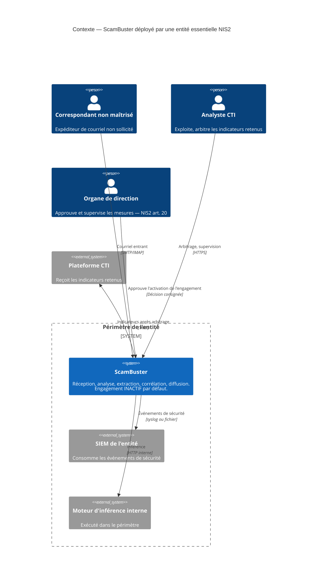
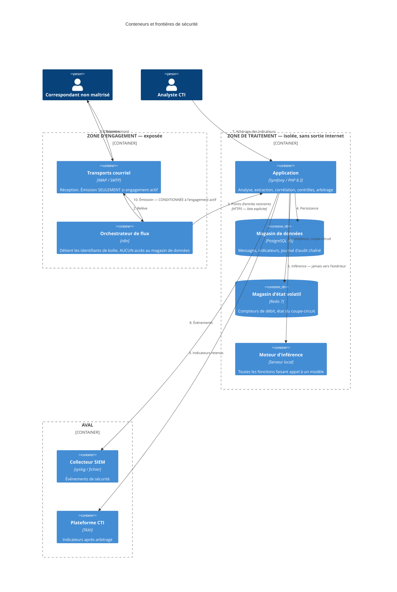
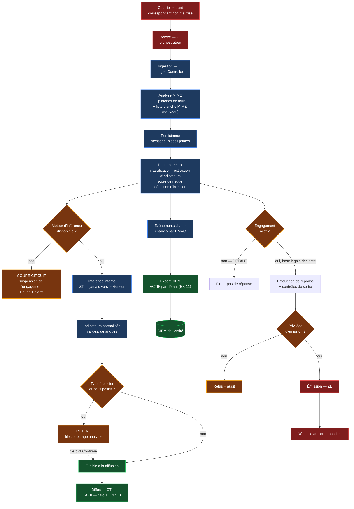
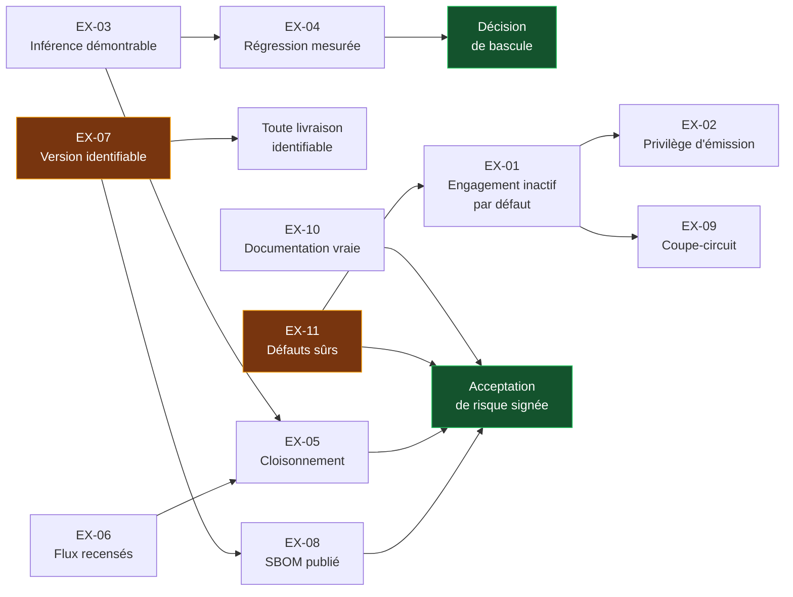

# Plan — architecture cible

> **Portée.** Comment satisfaire `audit/spec.md`. Les technologies sont nommées ici, et
> chaque brique est justifiée contre une contrainte mesurée.
>
> **Contrainte de dimensionnement (R5).** Trafic courriel humain, quelques messages par
> minute au pic. Plafonds configurés : 50 conversations actives/jour, 200 appels LLM/h
> (`config/packages/rate_limiter.yaml:33-41`). Toute brique dont la justification
> reposerait sur un débit supérieur est écartée et signalée.
>
> **Principe directeur.** L'écrasante majorité des exigences se satisfait avec des
> mécanismes **déjà présents dans le code**. Le plan privilégie systématiquement leur
> réemploi à l'introduction d'un composant.

---

## 1. Les deux zones

| | **Zone d'engagement (ZE)** | **Zone de traitement (ZT)** |
|---|---|---|
| Rôle | Dialogue avec des correspondants non maîtrisés | Détient les données et la logique métier |
| Composants | Orchestrateur de flux, transports de réception et d'émission | Application, base de données, magasin d'état volatil, moteur d'inférence |
| Hypothèse de sécurité | **Compromissible** — traite des pièces jointes adverses | À protéger d'un pivot depuis la ZE |
| Sortie Internet | Réception et émission uniquement | **Aucune** en cible |
| Détient des identifiants | Ceux des boîtes de réception et d'émission | Ceux de la base et de l'inférence interne |

La frontière est **unidirectionnelle en initiative** : la ZE appelle un jeu restreint
de points d'entrée de la ZT ; la ZT n'initie jamais de connexion vers la ZE.

---

## 2. Contexte — niveau 1 (C4)

**Ce que ce niveau fixe.** Le moteur d'inférence est **dans** le périmètre de
l'entité — c'est EX-03. L'engagement est inactif par défaut — c'est EX-01, et cela
supprime la flèche de sortie vers le correspondant à l'installation.

---

## 3. Conteneurs — niveau 2 (C4)

**Frontières de sécurité, et ce qu'elles portent.**

| Frontière | Exigence | Moyen |
|---|---|---|
| ZE → ZT | EX-05 | Réseaux distincts ; ZT en `internal: true` ; seuls les points d'entrée du flux joignables depuis la ZE |
| ZT → Internet | EX-03, EX-05 | Aucune sortie. Le moteur d'inférence étant interne, la ZT n'a plus de destination externe légitime |
| Émission | EX-01, EX-02 | Double condition : engagement actif **et** privilège d'émission détenu |
| Inférence | EX-03 | Réglage unique, aucune destination ni identifiant de modèle en dur |
| Arbitrage | *(existant)* | Le blocage d'export financier reste en place, inchangé |

---

## 4. Flux de données — de l'entrant au SIEM

**Trois points de contrôle nouveaux, en jaune.** Le coupe-circuit sur la disponibilité
du moteur (EX-09), la porte d'engagement (EX-01) et la porte de privilège d'émission
(EX-02). Les deux autres portes — arbitrage des indicateurs financiers, filtre
TLP:RED — **existent déjà** et sont conservées telles quelles.

---

## 5. Choix de briques, justifiés

| # | Décision | Justification contre une contrainte mesurée | Alternative écartée |
|---|---|---|---|
| B1 | **Réemployer le kill switch existant** comme porte d'engagement, en inversant son défaut et en étendant sa portée à l'émission | Le mécanisme existe (`ReplyCadenceService.php:55-77`), il est déjà exposé en supervision (`scambuster_kill_switch`) et déjà alerté. Coût quasi nul | Construire un drapeau d'activation distinct — dupliquerait un état existant |
| B2 | **Séparer la porte d'engagement du kill switch d'urgence** en deux états distincts, la première étant une décision de configuration, le second une bascule d'exploitation | Confondre les deux rendrait impossible de distinguer « non autorisé » de « suspendu temporairement », alors que EX-01 et EX-09 exigent des journaux distincts | Un état unique à trois valeurs — moins lisible en supervision |
| B3 | **Ajouter une permission `reply:send`** au modèle existant | `PermissionVoter` fonctionne déjà par permission ; passer de 14 à 15 cas est une modification triviale (`Permission.php:19-40`) | File d'approbation humaine — coût d'exploitation prohibitif pour 1 à 3 personnes à 50 conversations/jour |
| B4 | **Serveur d'inférence local, instance unique, sans mise à l'échelle** | 200 appels/h au plafond configuré, soit ~3/min. Une instance unique traite plusieurs requêtes par seconde | Grappe, file d'inférence, équilibrage : **sur-dimensionnés d'au moins deux ordres de grandeur** |
| B5 | **Réemployer le port `LLMClientInterface` et l'adaptateur Ollama existants** | Le port et l'adaptateur sont écrits (`OllamaClient.php`) ; le travail est de supprimer les contournements, pas d'écrire un client | Nouvelle couche d'abstraction — le port existant est adéquat |
| B6 | **Supprimer la seconde interface `LLMServiceInterface`** plutôt que la faire coexister | Deux abstractions concurrentes rendent EX-03 indémontrable : un contrôle automatisé ne peut pas garantir l'exhaustivité si deux chemins existent | La conserver pour la préproduction — la préproduction peut utiliser le port unique |
| B7 | **Doter le service d'embeddings du port existant** | C'est le seul appel qui court-circuite toute abstraction (`EmbeddingService.php:20`, `HttpClientInterface` direct). Sans lui, EX-03 est faux | Laisser les embeddings sortir — contredit A3.1 |
| B8 | **Deux réseaux Docker, ZT en `internal: true`** | Traite le pivot latéral (menace T4) pour quelques lignes de configuration, sans composant nouveau | Hôtes séparés + proxy : **sur-dimensionné** à cette cadence, double la charge d'administration pour un gain marginal |
| B9 | **Aucun proxy sortant applicatif** | La ZT n'ayant plus de destination externe après B4, un proxy n'aurait rien à filtrer. Le filtrage résiduel porte sur la ZE et relève de l'hôte | Proxy filtrant en ZT — composant sans objet, et qui verrait tout le trafic en clair |
| B10 | **Attacher le SBOM déjà produit à une publication versionnée** | Le SBOM CycloneDX est généré à chaque intégration (`ci.yml:332-337`) mais jeté après 30 jours. Le travail est la distribution, pas la production | Chaîne de signature et attestation de provenance : **sur-dimensionnée** au regard des sources citées |
| B11 | **Piloter le coupe-circuit depuis un compteur d'échecs consécutifs, dans le magasin d'état volatil** | Redis est déjà présent et porte déjà l'état du kill switch. Un compteur de plus est gratuit | Sonde de santé dédiée, service de disjoncteur : composants nouveaux pour un état trivial |
| B12 | **Liste blanche de types MIME sur les pièces jointes** | EX-05 et la menace T4 : le composant le plus exposé traite aujourd'hui tout type sans restriction (`EmailParsingService.php:275`) | Bac à sable d'analyse : sur-dimensionné, et sans objet puisque le binaire n'est pas persisté |
| B13 | **`SIEM_PROVIDER` par défaut à `file`**, et refus de démarrage en production si laissé à `none` sans déclaration explicite | EX-11. Un défaut `none` prive le déployeur de tout événement à l'installation ; `file` n'exige aucune infrastructure et n'écrit vers aucun collecteur non configuré | Défaut `syslog` — écrirait vers une destination non configurée |

---

## 6. Ce qui est explicitement **conservé sans modification**

Rappel de la règle R2 : ces composants existent, ils ne sont pas dupliqués.

| Composant | Motif de conservation |
|---|---|
| `PolicyGuard` et ses 6 jeux de motifs | Contrôle de sortie déterministe opérant. **Réserve** : si EX-01 conduit un jour à activer l'engagement avec divulgation, `FORBIDDEN_PATTERNS` devra être réexaminé — mais pas avant |
| Blocage d'export des indicateurs financiers et chemin de libération par verdict | Répond déjà, pour la classe qu'il couvre, au besoin d'arbitrage humain |
| Chaîne d'audit HMAC et vérification quotidienne | Conservée. Le durcissement (application du `REVOKE`) relève d'écarts déclassés en S2 |
| Les 8 limiteurs de débit | **Largement dimensionnés** pour la cadence mesurée ; aucun ajustement justifié |
| Porte GUARD, oracle et baseline gelé | Deviennent l'instrument de mesure de EX-04 ; aucune modification, sous peine d'invalider la comparaison |
| Filtre TLP:RED sur la diffusion TAXII | Conservé |
| `SignatureStripper`, `PaymentInstigationGuard`, détection d'injection | Conservés. Leur comportement en défaillance est corrigé par EX-09, pas leur logique |

---

## 7. Dépendances entre exigences

**Deux préalables sans dépendance amont**, en jaune : EX-07 (version) et EX-11
(défauts sûrs). Ils conditionnent le reste et doivent être traités en premier.

**Une dépendance non évidente** : EX-03 conditionne EX-05. [DÉDUIT] Tant que
l'inférence sort vers Internet, la zone de traitement ne peut pas être déclarée
`internal: true` — le cloisonnement casserait le produit. Raisonnement : les appels
d'inférence partent de l'application, qui est en ZT ; les rapatrier est le préalable
technique de l'isolement.

---

## 8. Ordre de traitement retenu

| Rang | Exigences | Motif |
|---|---|---|
| 1 | EX-07, EX-11 | Préalables sans dépendance ; effort faible ; rendent tout le reste livrable et identifiable |
| 2 | EX-01, EX-02 | Effort très faible, réemploi direct de mécanismes existants ; lèvent les deux écarts bloquants les plus graves |
| 3 | EX-10 | Peut avancer en parallèle ; sans coût technique ; conditionne l'acceptation de risque |
| 4 | EX-06 | Livrable documentaire ; préalable de EX-05 |
| 5 | EX-03 puis EX-04 | Le poste de travail réel. EX-04 ne peut pas précéder EX-03 |
| 6 | EX-05 | Nécessite EX-03 achevée |
| 7 | EX-09 | Après EX-03 : le coupe-circuit reste nécessaire, mais son seuil se règle sur le comportement du moteur retenu |
| 8 | EX-08 | Après EX-07 ; s'automatise dans la chaîne de publication |

---

## 9. Ce que ce plan ne construit pas, et pourquoi

| Non construit | Motif |
|---|---|
| File de messages ou bus asynchrone | Aucun besoin mesuré. Les conteneurs à boucle shell existants suffisent à quelques messages par minute |
| Maillage de services, politiques réseau fines | Deux réseaux Docker couvrent la menace identifiée. Au-delà : sur-dimensionné |
| Infrastructure de signature d'artefacts | Aucune source citée ne l'exige pour ce scénario |
| Stockage WORM pour le journal d'audit | Déclassé avec le scénario S1 ; l'exigence retenue est la fiabilité, non la preuve opposable |
| Détection automatique de données sensibles à l'ingestion | Écart réel, mais l'argument de non-traitement retenu en phase 2 tient : la réponse passe par la minimisation, non par une détection peu fiable |
| Multi-tenance, identité de nœud, provenance signée des flux | Relèvent du scénario S3, non retenu |
| Anonymisation du contenu libre | Substitut plus sûr retenu : la suppression |
