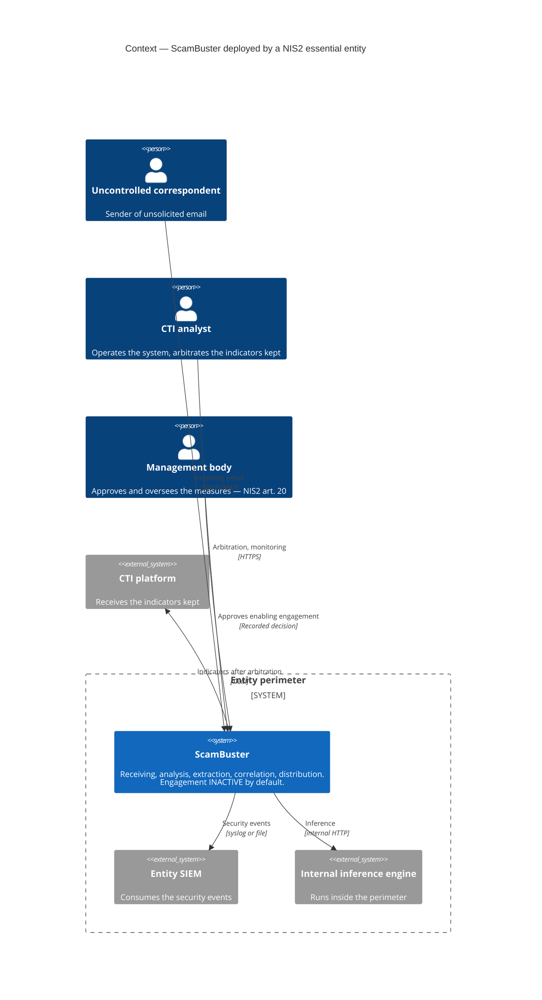
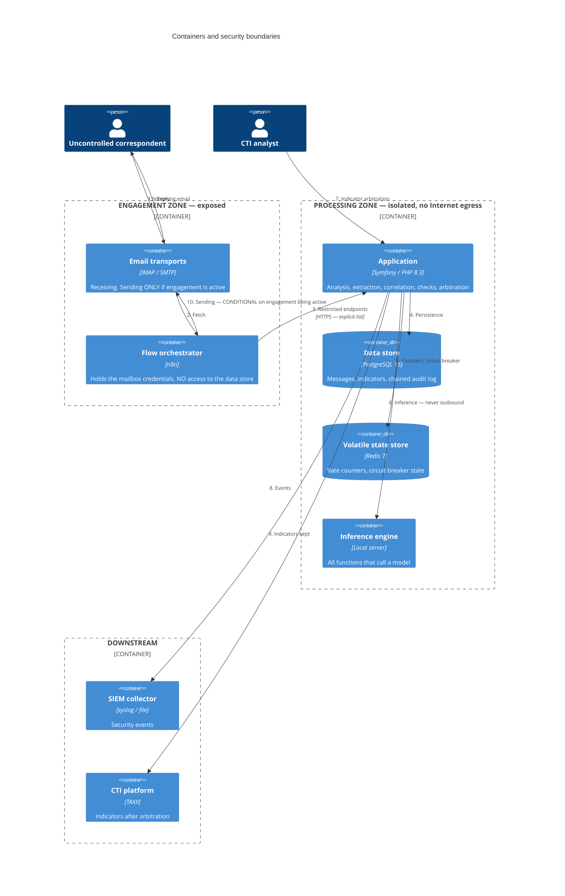
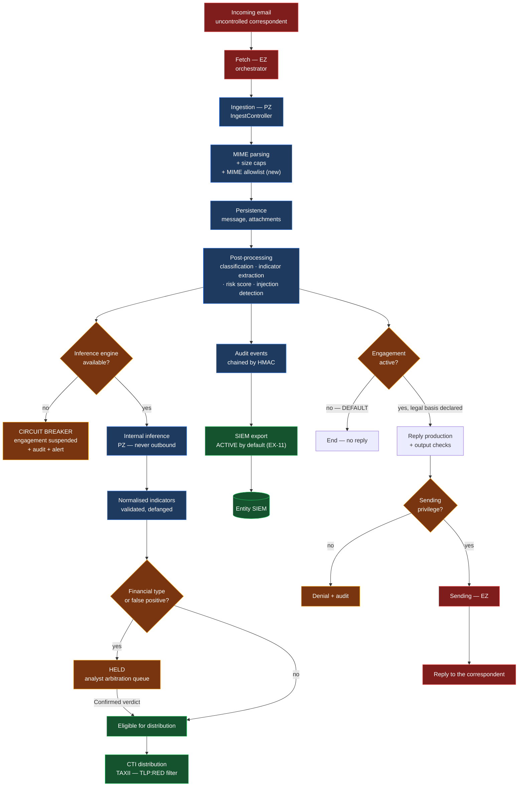
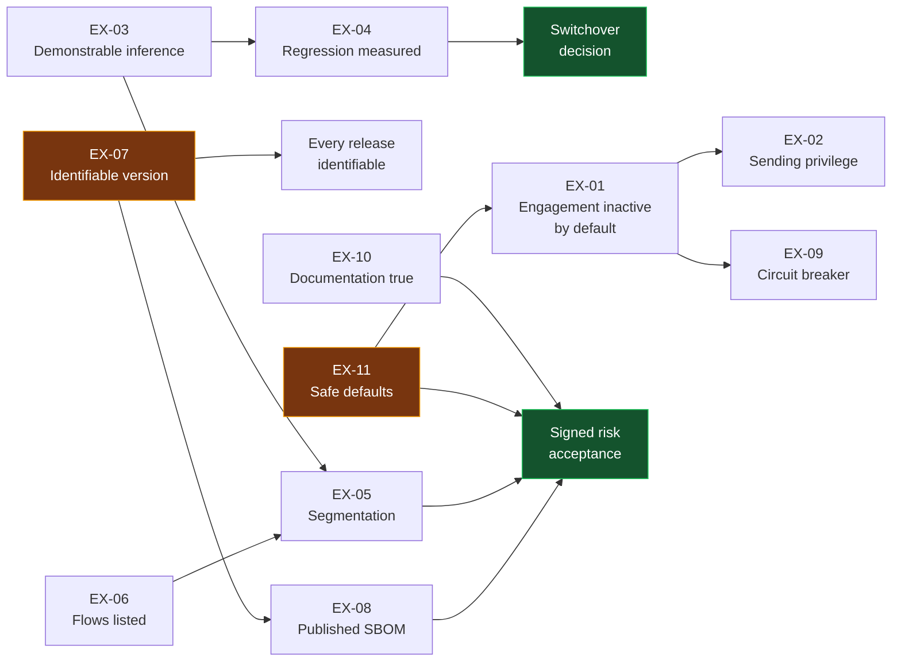

# Plan — target architecture

> **Scope.** How to satisfy `audit/spec.md`. Technologies are named here, and
> every building block is justified against a measured constraint.
>
> **Sizing constraint (R5).** Human email traffic, a few messages per
> minute at peak. Configured caps: 50 active conversations/day, 200 LLM calls/h
> (`config/packages/rate_limiter.yaml:33-41`). Any building block whose justification
> would rest on a higher throughput is set aside and flagged.
>
> **Guiding principle.** The vast majority of requirements can be satisfied with
> mechanisms **already present in the code**. The plan systematically favours
> reusing them over introducing a component.

---

## 1. The two zones

| | **Engagement zone (EZ)** | **Processing zone (PZ)** |
|---|---|---|
| Role | Talks to uncontrolled correspondents | Holds the data and the business logic |
| Components | Flow orchestrator, receiving and sending transports | Application, database, volatile state store, inference engine |
| Security assumption | **Can be compromised** — processes adversary attachments | To be protected from a pivot out of the EZ |
| Internet egress | Receiving and sending only | **None** in the target |
| Holds credentials | Those of the inbound and outbound mailboxes | Those of the database and of internal inference |

The boundary is **one-way in terms of initiative**: the EZ calls a restricted set
of PZ endpoints; the PZ never initiates a connection towards the EZ.

---

## 2. Context — level 1 (C4)

**What this level fixes.** The inference engine is **inside** the entity's
perimeter — that is EX-03. Engagement is inactive by default — that is EX-01, and it
removes the outgoing arrow towards the correspondent at installation time.

---

## 3. Containers — level 2 (C4)

**Security boundaries, and what they carry.**

| Boundary | Requirement | Means |
|---|---|---|
| EZ → PZ | EX-05 | Separate networks; PZ set to `internal: true`; only the flow endpoints reachable from the EZ |
| PZ → Internet | EX-03, EX-05 | No egress. Since the inference engine is internal, the PZ no longer has any legitimate external destination |
| Sending | EX-01, EX-02 | Two conditions: engagement active **and** the sending privilege held |
| Inference | EX-03 | Single setting, no hard-coded destination or model identifier |
| Arbitration | *(existing)* | The financial export block stays in place, unchanged |

---

## 4. Data flow — from incoming message to SIEM

**Three new control points, in yellow.** The circuit breaker on engine
availability (EX-09), the engagement gate (EX-01) and the sending privilege gate
(EX-02). The two other gates — financial indicator arbitration, TLP:RED
filter — **already exist** and are kept as they are.

---

## 5. Building-block choices, justified

| # | Decision | Justification against a measured constraint | Alternative set aside |
|---|---|---|---|
| B1 | **Reuse the existing kill switch** as the engagement gate, inverting its default and extending its scope to sending | The mechanism exists (`ReplyCadenceService.php:55-77`), it is already exposed in monitoring (`scambuster_kill_switch`) and already alerted on. Almost zero cost | Building a separate enablement flag — would duplicate an existing state |
| B2 | **Separate the engagement gate from the emergency kill switch** into two distinct states, the first being a configuration decision, the second an operating switch | Conflating the two would make it impossible to tell "not authorised" from "temporarily suspended", whereas EX-01 and EX-09 require distinct logs | A single three-valued state — less readable in monitoring |
| B3 | **Add a `reply:send` permission** to the existing model | `PermissionVoter` already works permission by permission; going from 14 to 15 cases is a trivial change (`Permission.php:19-40`) | A human approval queue — prohibitive operating cost for 1 to 3 people at 50 conversations/day |
| B4 | **Local inference server, single instance, no scaling** | 200 calls/h at the configured cap, i.e. ~3/min. A single instance handles several requests per second | Cluster, inference queue, load balancing: **over-engineered by at least two orders of magnitude** |
| B5 | **Reuse the `LLMClientInterface` port and the existing Ollama adapter** | The port and the adapter are written (`OllamaClient.php`); the work is to remove the bypasses, not to write a client | A new abstraction layer — the existing port is adequate |
| B6 | **Remove the second `LLMServiceInterface` interface** rather than let it coexist | Two competing abstractions make EX-03 impossible to demonstrate: an automated check cannot guarantee completeness if two paths exist | Keeping it for pre-production — pre-production can use the single port |
| B7 | **Give the embedding service the existing port** | It is the only call that bypasses every abstraction (`EmbeddingService.php:20`, `HttpClientInterface` directly). Without it, EX-03 is false | Letting embeddings leave the perimeter — contradicts A3.1 |
| B8 | **Two Docker networks, PZ set to `internal: true`** | Addresses lateral pivoting (threat T4) for a few lines of configuration, with no new component | Separate hosts + proxy: **over-engineered** at this rate, doubles the administration effort for a marginal gain |
| B9 | **No application-level outbound proxy** | Since the PZ no longer has an external destination after B4, a proxy would have nothing to filter. The residual filtering concerns the EZ and belongs to the host | A filtering proxy in the PZ — a component with no purpose, and one that would see all traffic in clear text |
| B10 | **Attach the SBOM already produced to a versioned release** | The CycloneDX SBOM is generated on every integration (`ci.yml:332-337`) but discarded after 30 days. The work is distribution, not production | A signing chain and provenance attestation: **over-engineered** given the sources cited |
| B11 | **Drive the circuit breaker from a consecutive-failure counter, in the volatile state store** | Redis is already present and already carries the kill switch state. One more counter is free | A dedicated health probe, a circuit breaker service: new components for a trivial state |
| B12 | **MIME type allowlist on attachments** | EX-05 and threat T4: the most exposed component today processes any type without restriction (`EmailParsingService.php:275`) | An analysis sandbox: over-engineered, and pointless since the binary is not persisted |
| B13 | **`SIEM_PROVIDER` defaulting to `file`**, and refusal to start in production if left at `none` without an explicit declaration | EX-11. A `none` default deprives the deployer of any event at installation time; `file` requires no infrastructure and writes to no unconfigured collector | A `syslog` default — would write to an unconfigured destination |

---

## 6. What is explicitly **kept unchanged**

A reminder of rule R2: these components exist, they are not duplicated.

| Component | Reason for keeping it |
|---|---|
| `PolicyGuard` and its 6 pattern sets | A working deterministic output check. **Caveat**: if EX-01 one day leads to enabling engagement with disclosure, `FORBIDDEN_PATTERNS` will have to be reviewed — but not before |
| Financial indicator export block and the verdict-based release path | Already meets, for the class it covers, the need for human arbitration |
| HMAC audit chain and daily verification | Kept. The hardening (applying the `REVOKE`) belongs to gaps downgraded in S2 |
| The 8 rate limiters | **Generously sized** for the measured rate; no adjustment justified |
| GUARD gate, oracle and frozen baseline | They become the measuring instrument for EX-04; no change, on pain of invalidating the comparison |
| TLP:RED filter on TAXII distribution | Kept |
| `SignatureStripper`, `PaymentInstigationGuard`, injection detection | Kept. Their behaviour on failure is corrected by EX-09, not their logic |

---

## 7. Dependencies between requirements

**Two prerequisites with no upstream dependency**, in yellow: EX-07 (version) and EX-11
(safe defaults). They condition the rest and must be handled first.

**One non-obvious dependency**: EX-03 conditions EX-05. [INFERRED] As long as
inference goes out to the Internet, the processing zone cannot be declared
`internal: true` — segmentation would break the product. Reasoning: the inference
calls start from the application, which is in the PZ; bringing them back inside is the
technical prerequisite for isolation.

---

## 8. Order of work chosen

| Rank | Requirements | Reason |
|---|---|---|
| 1 | EX-07, EX-11 | Prerequisites with no dependency; low effort; make everything else deliverable and identifiable |
| 2 | EX-01, EX-02 | Very low effort, direct reuse of existing mechanisms; close the two most serious blocking gaps |
| 3 | EX-10 | Can progress in parallel; no technical cost; conditions the risk acceptance |
| 4 | EX-06 | A documentation deliverable; a prerequisite of EX-05 |
| 5 | EX-03 then EX-04 | The real workload. EX-04 cannot come before EX-03 |
| 6 | EX-05 | Requires EX-03 to be complete |
| 7 | EX-09 | After EX-03: the circuit breaker is still needed, but its threshold is set from the behaviour of the chosen engine |
| 8 | EX-08 | After EX-07; becomes automated in the release chain |

---

## 9. What this plan does not build, and why

| Not built | Reason |
|---|---|
| Message queue or asynchronous bus | No measured need. The existing shell-loop containers are enough for a few messages per minute |
| Service mesh, fine-grained network policies | Two Docker networks cover the identified threat. Beyond that: over-engineered |
| Artefact signing infrastructure | No cited source requires it for this scenario |
| WORM storage for the audit log | Downgraded with scenario S1; the requirement kept is reliability, not evidence admissible against a party |
| Automatic detection of sensitive data at ingestion | A real gap, but the non-processing argument kept in phase 2 holds: the answer lies in minimisation, not in unreliable detection |
| Multi-tenancy, node identity, signed flow provenance | Belong to scenario S3, which was not selected |
| Anonymisation of free-text content | A safer substitute was chosen: deletion |
