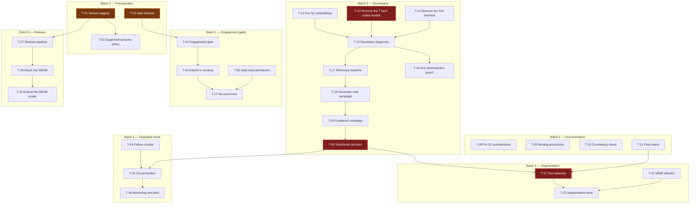

# Tasks — sequencing and dependencies

> **Scope.** Breakdown of `audit/spec.md` following `audit/plan.md`. Every task
> carries the requirement it derives from and the originating gap.
>
> **Effort.** Relative scale: **XS** ≈ less than half a day · **S** ≈ 1 to 2 days ·
> **M** ≈ 3 to 5 days · **L** ≈ 1 to 2 weeks. Estimates for one person
> who knows the code.
>
> **No task modifies an existing control** unless explicitly stated.

---

## Dependency overview

**Critical path** in red: T-13 → T-15 → T-17 → T-18 → T-19 → T-20 → T-21 → T-23.
Everything else can progress in parallel.

---

## Batch 0 — Prerequisites

No upstream dependency. To be handled first: they make everything else identifiable.

| ID | Task | Requirement | Gap | Effort | Depends on |
|---|---|---|---|---|---|
| **T-01** | Set a first version tag following semantic versioning; close the `[Unreleased]` section of the change log; expose the version at runtime by reading it from the release and not from a constant | EX-07 | G-24 | **XS** | — |
| **T-02** | Replace "main \| Yes" in `SECURITY.md` with a supported-versions policy stating the support duration and the target fix lead time | EX-07 | G-24 | **XS** | T-01 |
| **T-03** | List the settings whose permissive value weakens a security property, and for each one: either invert the default, or add a refusal to start in production. **Minimum scope**: `SIEM_PROVIDER` (`none` → `file`), `SCAMBUSTER_SAFE_DOMAINS` (`*` → empty list + refusal), `LLM_BUDGET_ENFORCEMENT_MODE` (`warning` → `enforce`), scheduling of the purge command in line with the announced retention | EX-11 | G-15, G-22, G-34 | **S** | — |

**Exit criterion for the batch.** An installation built from the shipped configuration
no longer exposes any security property that depends on an action the deployer
would have to guess (A11.1), and the running version is identifiable (A7.1).

---

## Batch 1 — Engagement gates

The most profitable batch: very low effort, it closes the two most serious blocking
gaps.

| ID | Task | Requirement | Gap | Effort | Depends on |
|---|---|---|---|---|---|
| **T-04** | Introduce an **engagement enablement** state, distinct from the emergency kill switch. Inactive by default. Enabling it requires a recorded declaration of the basis on which the deployer enables it, and produces an audit entry | EX-01 | G-01 | **S** | T-03 |
| **T-05** | Extend the gate to **all** sending endpoints — not only to generation, which is all the current kill switch covers. List the endpoints concerned before starting | EX-01 | G-01, G-02 | **S** | T-04 |
| **T-06** | Add a sending permission distinct from the production right; require it on the sending endpoints and on those marking a message as sent; remove that right from the orchestration principal in the reference data sets | EX-02 | G-21 | **XS** | — |
| **T-07** | Write the tests proving that no path sends while engagement is inactive, and that a principal without the sending right is denied on **all** the endpoints concerned. Also check that, with engagement inactive, the volume of extracted indicators is unchanged | EX-01, EX-02 | G-01, G-21 | **S** | T-05, T-06 |

**Exit criterion for the batch.** A campaign of 20 incoming messages on a fresh
installation produces 0 outgoing message (A1.1) and the same volume of extracted
indicators as with engagement active (A1.3).

---

## Batch 2 — Truthful documentation and flow inventory

No technical dependency; can progress entirely in parallel with batches 1 and 3.

| ID | Task | Requirement | Gap | Effort | Depends on |
|---|---|---|---|---|---|
| **T-08** | Handle the **25 contradictions** listed in `00_inventory.md` §11, each one either by correcting the documentation or by implementing the announced control. Handle first those about controls that do not exist: missing blocking categories, missing database isolation policies, content encryption announced and absent, retention announced as automatic and not scheduled | EX-10 | G-40 | **M** | — |
| **T-09** | Write the two operating procedures that are referenced but do not exist: applying the write lock on the audit table, and the chain rebuild script mentioned by the key rotation procedure | EX-10 | G-41 | **S** | — |
| **T-10** | Add an automated check verifying that the numeric values quoted in the documentation — pattern counts, permission counts, retention durations, thresholds — match those in the code | EX-10 | G-40 | **S** | T-08 |
| **T-11** | Publish the **outbound flow matrix**: destination, protocol, trigger, nature of the data, mandatory or optional. Explicitly flag the flows transmitting adversary-originated data to a third party, and make them independently disableable. **The starting inventory exists** in `00_inventory.md` §2 | EX-06 | G-07, G-08, G-14 | **S** | — |

**Exit criterion for the batch.** No documentation statement about an implemented
control is contradicted by the code (A10.1), and the matrix is enough to build a
filtering policy without reading the code (A6.2).

---

## Batch 3 — Inference sovereignty

The real workload, and the critical path.

### 3a — Refactoring

| ID | Task | Requirement | Gap | Effort | Depends on |
|---|---|---|---|---|---|
| **T-12** | Route the vectorisation service through the existing inference port, instead of the direct HTTP client with a hard-coded destination and model | EX-03 | G-05 | **S** | — |
| **T-13** | Remove the **7 hard-coded model identifiers** from the call sites, and have them resolved by configuration. Handle the associated temperature and length parameters at the same time | EX-03 | G-04 | **M** | — |
| **T-14** | Remove the second, legacy inference interface and its hard-coded-destination adapter; route the pre-production generator through the single port | EX-03 | G-06 | **S** | T-13 |
| **T-15** | Add a diagnostic command reporting, for every function that calls a model, the destination and the model actually resolved | EX-03 | G-04 | **S** | T-12, T-13, T-14 |
| **T-16** | Add an integration check that fails if a model identifier or an inference destination is reintroduced hard-coded | EX-03 | G-04 | **XS** | T-15 |

### 3b — Measuring the regression

None of these tasks modifies the oracle or the baseline: any change
would invalidate the comparison (A4.2).

| ID | Task | Requirement | Gap | Effort | Depends on |
|---|---|---|---|---|---|
| **T-17** | Refreeze a **reference baseline** on the current model with the current corpus, checking that the oracle fingerprint is unchanged | EX-04 | G-03 | **S** | T-15 |
| **T-18** | Candidate campaign with the internal engine **in production only**, the checking functions staying on the reference engine. Produce the report: approval rate, fallback rate, average attempts, rate by violation code, extraction precision and recall | EX-04 | G-03 | **M** | T-17 |
| **T-19** | Combined campaign: internal engine for the checking functions as well. Compare with T-18 to isolate the share of regression attributable to the checks | EX-04 | G-03 | **S** | T-18 |
| **T-20** | **Switchover decision**, taken on the single non-regression criterion already in force. If it fails: document the measured gap and arbitrate between a larger model and keeping the external engine under contract | EX-04 | G-03 | **S** | T-19 |

**Exit criterion for the batch.** The diagnostic command shows a single resolution
for all functions (A3.3), and the complete campaign produces no external
request carrying message content (A3.1).

**Point of attention.** T-18 is the heart of the protocol. If the checking functions
switch at the same time as production, the measurement is confounded and may look
favourable: a weakened check approves more, which pushes the approval rate up
while quality goes down.

---

## Batch 4 — Segmentation

Cannot come before T-20: as long as inference goes out, isolating the processing zone
breaks the product.

| ID | Task | Requirement | Gap | Effort | Depends on |
|---|---|---|---|---|---|
| **T-21** | Separate the two zones into two network domains; mark the processing zone as having no outbound access; expose to the engagement zone only the flow endpoints, explicitly listed | EX-05 | G-07, G-08 | **M** | T-20, T-11 |
| **T-22** | Introduce an allowlist of attachment types for parsing; log and discard unlisted types | EX-05 | G-10 | **S** | — |
| **T-23** | Tests proving that no direct connection to the data store or the state store is possible from the engagement zone, and that the nominal flow works after segmentation | EX-05 | G-07 | **S** | T-21, T-22 |

**Exit criterion for the batch.** A5.1 and A5.3 satisfied.

---

## Batch 5 — Safe degraded mode

| ID | Task | Requirement | Gap | Effort | Depends on |
|---|---|---|---|---|---|
| **T-24** | Count consecutive inference engine failures in the volatile state store; threshold configurable and documented, distinguishing a transient error from unavailability | EX-09 | G-30 | **S** | — |
| **T-25** | When the threshold is crossed, suspend engagement rather than continuing with degraded checks. Explicit resumption on recovery. Suspension and resumption each produce an audit entry | EX-09 | G-30 | **S** | T-24, T-20 |
| **T-26** | Expose the suspended state in monitoring and attach it to an alert. **Reuse** the existing kill switch metric and alerting rule rather than creating new ones | EX-09 | G-30 | **XS** | T-25 |

**Exit criterion for the batch.** With unavailability simulated, 0 outgoing message (A9.1) and
the state is visible in monitoring within less than one collection period
(A9.2).

---

## Batch 6 — Release pipeline

| ID | Task | Requirement | Gap | Effort | Depends on |
|---|---|---|---|---|---|
| **T-27** | Add a release pipeline triggered by the pushing of a tag, producing an identified release with its change log | EX-07 | G-24 | **S** | T-01 |
| **T-28** | Attach to every release the SBOM **already produced** by the integration pipeline, instead of letting it expire as a temporary artefact | EX-08 | G-25 | **XS** | T-27 |
| **T-29** | Check the scope of the SBOM and extend it if it does not cover the dependencies of both application chains in addition to the base packages | EX-08 | G-25 | **S** | T-28 |

**Exit criterion for the batch.** The published SBOM matches the artefact published
under the same version (A8.2) and covers direct and transitive dependencies (A8.1).

---

## Proposed sequencing

| Milestone | Content | Effect obtained |
|---|---|---|
| **J1** | Batch 0 + Batch 1 + T-06 | **The two most serious blocking gaps are closed.** A third party can deploy in S2 without engagement, with an identifiable version and safe defaults. Cumulative effort: ~S to M |
| **J2** | Batch 2 + Batch 6 | The documentation file becomes usable for a risk acceptance; the SBOM is distributed. **Product reporting deadline met** |
| **J3** | Batch 3a then 3b | Inference is demonstrable and the regression is measured. Main workload |
| **J4** | Batch 4 + Batch 5 | Effective segmentation and safe degraded mode |

[INFERRED] **J1 and J2 have no dependency on J3.** A deployer can therefore go into
service at the end of J2, in no-engagement mode, without waiting for inference
sovereignty — since without engagement, the functions calling a model come down to
classification, extraction and correlation, whose transfer the deployer can accept
contractually for the duration of J3. Reasoning: the engagement gate of
T-04 removes the production and output-check calls, which are the largest in
volume and the ones carrying the most complete content.

---

## Deliberately unplanned tasks

A reminder of the trade-offs, so that none is picked up again by mistake.

| Not planned | Gap | Reason |
|---|---|---|
| Disclosure of the artificial nature in the outgoing message | G-01 | The recommendation kept is to disable engagement by default, not to make it compliant. To be reopened only if a deployer covered by the exemption asks for the function |
| Removal of the anti-disclosure patterns from `PolicyGuard` | G-01 | A consequence of the previous line: they remain relevant for a deployer covered by the exemption |
| Human approval queue before every send | G-21 | Prohibitive operating cost for 1 to 3 people; the privilege separation is enough for the requirement cited |
| Write lock on the audit table | G-16 | Downgraded with scenario S1. **Except** the documented procedure, which is T-09 |
| Broadening the deterministic payment vocabulary fallback | G-30 | The code itself declares completeness unreachable; T-25 addresses the cause |
| Human arbitration on non-financial indicators | G-11 | Would make the product unusable by one person. To be handled by a graduated response, outside the scope of this batch |
| Anonymisation of retained content | G-35 | Deletion is a safer substitute. The gap is about the documentation claim, handled by T-08 |
| Artefact signing and provenance attestation | G-26 | Over-engineered given the sources cited and the size of the team |
| Pinning images by digest | G-26 | Open trade-off: it also freezes the base fixes, whereas the build already applies updates. Left as advice, not as a task |
| Multi-tenancy, node identity, signed flow provenance | — | Belong to scenario S3, which was not selected |
| Masking identifiers in the SIEM export | G-42 | An enterprise SIEM is a trusted recipient. **The associated documentation contradiction (DOC-25) is handled by T-08** |
| OIDC redirect URI validation and removal of tokens from the URL fragment | G-43 | Opt-in module, disabled by default; to be handled in the first cycle, outside the six gaps selected |
| Reference security alerting rule set | G-44 | Classically a matter for the deployer's monitoring; the product already exposes the events |

---

## What I could not verify — phase 4

1. Should setting a first tag reflect the real maturity of the product, or
   start from a conventional initial version — the choice shapes how
   deployers will read it?
2. What fix lead time can the publisher hold with a single maintainer, given
   that the supported-versions policy commits it?
3. Does the orchestration principal use a dedicated application account, or an
   operator's account — which would determine the real scope of T-06?
4. How many endpoints actually trigger a send? The inventory
   in T-05 must be done before sizing the task.
5. Does removing the second inference interface break the pre-production
   generator, and is that generator still used?
6. Is the structured response format required by several calls supported
   identically by the internal engine under consideration?
7. How long does a complete campaign take with an internal engine, given that it
   takes about 35 minutes with the current engine — this sizes T-18 and T-19?
8. Is the annotated reference set used for the precision and recall measurement
   present in the repository, and how large is it?
9. Is there an outbound flow constraint in the processing zone that the matrix in
   T-11 would reveal and that would prevent the isolation in T-21?
10. Which attachment types are actually encountered on receiving? A poorly
    calibrated allowlist would discard useful intelligence.
11. Which consecutive-failure threshold corresponds to real unavailability rather than
    a transient error from the engine?
12. Does the SBOM produced today cover the application dependencies, or
    only the base packages — which decides whether T-29 is a check or a
    development task?
13. Would a deployer accept going into service at the end of J2, in no-engagement
    mode and with external inference under contract, or would it require J3
    first?
14. Is the corpus of 99 fixtures representative of real traffic in its distribution of
    languages and types, a validity condition for the whole measurement in batch 3b?
