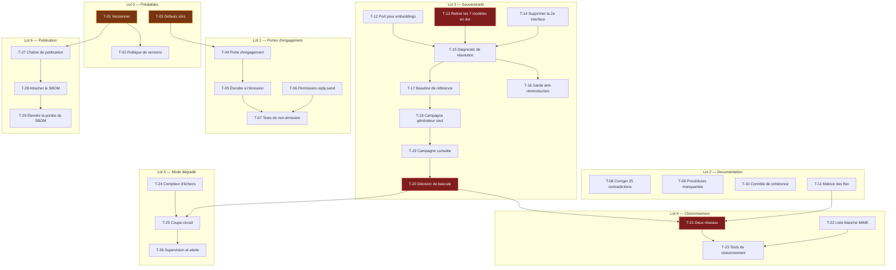

# Tâches — ordonnancement et dépendances

> **Portée.** Décomposition de `audit/spec.md` selon `audit/plan.md`. Chaque tâche
> porte l'exigence dont elle dérive et l'écart d'origine.
>
> **Charge.** Notation relative : **XS** ≈ moins d'une demi-journée · **S** ≈ 1 à 2 jours ·
> **M** ≈ 3 à 5 jours · **L** ≈ 1 à 2 semaines. Estimations pour une personne
> connaissant le code.
>
> **Aucune tâche ne modifie un contrôle existant** sauf mention explicite.

---

## Vue d'ensemble des dépendances

**Chemin critique** en rouge : T-13 → T-15 → T-17 → T-18 → T-19 → T-20 → T-21 → T-23.
Tout le reste peut avancer en parallèle.

---

## Lot 0 — Préalables

Sans dépendance amont. À traiter en premier : ils rendent tout le reste identifiable.

| ID | Tâche | Exigence | Écart | Charge | Dépend de |
|---|---|---|---|---|---|
| **T-01** | Poser un premier tag de version conforme au versionnement sémantique ; clore la section `[Unreleased]` du journal des changements ; exposer la version à l'exécution en la lisant depuis la publication et non depuis une constante | EX-07 | G-24 | **XS** | — |
| **T-02** | Remplacer « main \| Yes » de `SECURITY.md` par une politique de versions supportées énonçant la durée de support et le délai de correction visé | EX-07 | G-24 | **XS** | T-01 |
| **T-03** | Inventorier les réglages dont la valeur permissive affaiblit une propriété de sécurité, et pour chacun : soit inverser le défaut, soit ajouter un refus de démarrage en production. **Portée minimale** : `SIEM_PROVIDER` (`none` → `file`), `SCAMBUSTER_SAFE_DOMAINS` (`*` → liste vide + refus), `LLM_BUDGET_ENFORCEMENT_MODE` (`warning` → `enforce`), planification de la commande de purge conforme à la conservation annoncée | EX-11 | G-15, G-22, G-34 | **S** | — |

**Critère de sortie du lot.** Une installation issue de la configuration livrée
n'expose plus aucune propriété de sécurité dépendant d'une action que le déployeur
devrait deviner (A11.1), et la version exécutée est identifiable (A7.1).

---

## Lot 1 — Portes d'engagement

Le lot le plus rentable : effort très faible, il lève les deux écarts bloquants les
plus graves.

| ID | Tâche | Exigence | Écart | Charge | Dépend de |
|---|---|---|---|---|---|
| **T-04** | Introduire un état d'**activation de l'engagement**, distinct du kill switch d'urgence. Inactif par défaut. Son activation exige une déclaration consignée de la base sur laquelle le déployeur l'active, et produit une entrée d'audit | EX-01 | G-01 | **S** | T-03 |
| **T-05** | Étendre la porte à **tous** les points d'entrée d'émission — pas seulement à la génération, que le kill switch actuel couvre seul. Recenser les points d'entrée concernés avant de commencer | EX-01 | G-01, G-02 | **S** | T-04 |
| **T-06** | Ajouter une permission d'émission distincte du droit de production ; l'exiger sur les points d'entrée d'émission et de marquage comme émis ; retirer ce droit au principal d'orchestration dans les jeux de données de référence | EX-02 | G-21 | **XS** | — |
| **T-07** | Écrire les tests prouvant qu'aucun chemin n'émet lorsque l'engagement est inactif, et qu'un principal sans droit d'émission est refusé sur **tous** les points d'entrée concernés. Vérifier également qu'avec engagement inactif, le volume d'indicateurs extraits est inchangé | EX-01, EX-02 | G-01, G-21 | **S** | T-05, T-06 |

**Critère de sortie du lot.** Une campagne de 20 messages entrants sur installation
neuve produit 0 message sortant (A1.1) et le même volume d'indicateurs extraits
qu'avec engagement actif (A1.3).

---

## Lot 2 — Documentation véridique et recensement des flux

Sans dépendance technique ; peut avancer entièrement en parallèle des lots 1 et 3.

| ID | Tâche | Exigence | Écart | Charge | Dépend de |
|---|---|---|---|---|---|
| **T-08** | Traiter les **25 contradictions** recensées en `00_inventory.md` §11, chacune par correction de la documentation ou par implémentation du contrôle annoncé. Traiter en priorité celles portant sur des contrôles inexistants : catégories de blocage absentes, politiques d'isolation de base absentes, chiffrement de contenu annoncé et absent, rétention annoncée automatique et non planifiée | EX-10 | G-40 | **M** | — |
| **T-09** | Écrire les deux procédures d'exploitation référencées et inexistantes : l'application du verrouillage en écriture de la table d'audit, et le script de reconstruction de chaîne mentionné par la procédure de rotation de clé | EX-10 | G-41 | **S** | — |
| **T-10** | Ajouter un contrôle automatisé vérifiant que les valeurs numériques citées dans la documentation — comptages de motifs, de permissions, durées de conservation, seuils — correspondent à celles du code | EX-10 | G-40 | **S** | T-08 |
| **T-11** | Publier la **matrice des flux sortants** : destination, protocole, déclencheur, nature des données, caractère obligatoire ou facultatif. Signaler explicitement les flux transmettant une donnée d'origine adverse à un tiers, et les rendre désactivables indépendamment. **Le recensement de départ existe** en `00_inventory.md` §2 | EX-06 | G-07, G-08, G-14 | **S** | — |

**Critère de sortie du lot.** Aucune affirmation documentaire portant sur un contrôle
implémenté n'est contredite par le code (A10.1), et la matrice suffit à construire une
politique de filtrage sans lire le code (A6.2).

---

## Lot 3 — Souveraineté de l'inférence

Le poste de travail réel, et le chemin critique.

### 3a — Refactorisation

| ID | Tâche | Exigence | Écart | Charge | Dépend de |
|---|---|---|---|---|---|
| **T-12** | Faire passer le service de vectorisation par le port d'inférence existant, au lieu du client HTTP direct avec destination et modèle figés | EX-03 | G-05 | **S** | — |
| **T-13** | Retirer les **7 identifiants de modèle figés** des sites d'appel, et les faire résoudre par la configuration. Traiter en même temps les paramètres de température et de longueur associés | EX-03 | G-04 | **M** | — |
| **T-14** | Supprimer la seconde interface d'inférence héritée et son adaptateur à destination figée ; faire passer le générateur de préproduction par le port unique | EX-03 | G-06 | **S** | T-13 |
| **T-15** | Ajouter une commande de diagnostic restituant, pour chaque fonction faisant appel à un modèle, la destination et le modèle effectivement résolus | EX-03 | G-04 | **S** | T-12, T-13, T-14 |
| **T-16** | Ajouter un contrôle d'intégration échouant si un identifiant de modèle ou une destination d'inférence est réintroduit en dur | EX-03 | G-04 | **XS** | T-15 |

### 3b — Mesure de la régression

Aucune de ces tâches ne modifie l'oracle ni le baseline : toute modification
invaliderait la comparaison (A4.2).

| ID | Tâche | Exigence | Écart | Charge | Dépend de |
|---|---|---|---|---|---|
| **T-17** | Regeler un **baseline de référence** sur le modèle actuel avec le corpus courant, en vérifiant que l'empreinte de l'oracle est inchangée | EX-04 | G-03 | **S** | T-15 |
| **T-18** | Campagne candidate avec le moteur interne **en production seulement**, les fonctions de contrôle restant sur le moteur de référence. Produire le rapport : taux d'approbation, taux de repli, tentatives moyennes, taux par code de violation, précision et rappel d'extraction | EX-04 | G-03 | **M** | T-17 |
| **T-19** | Campagne cumulée : moteur interne également pour les fonctions de contrôle. Comparer à T-18 pour isoler la part de régression imputable aux contrôles | EX-04 | G-03 | **S** | T-18 |
| **T-20** | **Décision de bascule**, prononcée sur le seul critère de non-régression déjà en vigueur. En cas d'échec : documenter l'écart mesuré et arbitrer entre un modèle plus grand et le maintien du moteur externe sous contrat | EX-04 | G-03 | **S** | T-19 |

**Critère de sortie du lot.** La commande de diagnostic montre une résolution unique
pour toutes les fonctions (A3.3), et la campagne complète ne produit aucune requête
externe portant du contenu de message (A3.1).

**Point de vigilance.** T-18 est le cœur du protocole. Si les fonctions de contrôle
basculent en même temps que la production, la mesure est confondue et peut paraître
favorable : un contrôle affaibli approuve davantage, ce qui fait monter le taux
d'approbation alors que la qualité baisse.

---

## Lot 4 — Cloisonnement

Ne peut pas précéder T-20 : tant que l'inférence sort, isoler la zone de traitement
casse le produit.

| ID | Tâche | Exigence | Écart | Charge | Dépend de |
|---|---|---|---|---|---|
| **T-21** | Séparer les deux zones en deux domaines réseau ; marquer la zone de traitement sans accès sortant ; n'exposer vers la zone d'engagement que les points d'entrée du flux, recensés explicitement | EX-05 | G-07, G-08 | **M** | T-20, T-11 |
| **T-22** | Introduire une liste blanche de types de pièces jointes à l'analyse ; journaliser et écarter les types non listés | EX-05 | G-10 | **S** | — |
| **T-23** | Tests prouvant qu'aucune connexion directe au magasin de données ni au magasin d'état n'est possible depuis la zone d'engagement, et que le flux nominal fonctionne après cloisonnement | EX-05 | G-07 | **S** | T-21, T-22 |

**Critère de sortie du lot.** A5.1 et A5.3 satisfaits.

---

## Lot 5 — Mode dégradé sûr

| ID | Tâche | Exigence | Écart | Charge | Dépend de |
|---|---|---|---|---|---|
| **T-24** | Compter les échecs consécutifs du moteur d'inférence dans le magasin d'état volatil ; seuil configurable et documenté, distinguant l'erreur transitoire de l'indisponibilité | EX-09 | G-30 | **S** | — |
| **T-25** | Au franchissement du seuil, suspendre l'engagement plutôt que de poursuivre avec des contrôles dégradés. Reprise explicite au rétablissement. Suspension et reprise produisent chacune une entrée d'audit | EX-09 | G-30 | **S** | T-24, T-20 |
| **T-26** | Exposer l'état de suspension en supervision et le rattacher à une alerte. **Réemployer** l'indicateur et la règle d'alerte existants du kill switch plutôt que d'en créer | EX-09 | G-30 | **XS** | T-25 |

**Critère de sortie du lot.** En indisponibilité simulée, 0 message sortant (A9.1) et
l'état est visible en supervision dans un délai inférieur à une période de collecte
(A9.2).

---

## Lot 6 — Chaîne de publication

| ID | Tâche | Exigence | Écart | Charge | Dépend de |
|---|---|---|---|---|---|
| **T-27** | Ajouter une chaîne de publication déclenchée par la pose d'un tag, produisant une publication identifiée avec son journal des changements | EX-07 | G-24 | **S** | T-01 |
| **T-28** | Attacher à chaque publication la nomenclature de composants **déjà produite** par la chaîne d'intégration, au lieu de la laisser expirer en artefact temporaire | EX-08 | G-25 | **XS** | T-27 |
| **T-29** | Vérifier la portée de la nomenclature et l'étendre si elle ne couvre pas les dépendances des deux chaînes applicatives en plus des paquets du socle | EX-08 | G-25 | **S** | T-28 |

**Critère de sortie du lot.** La nomenclature publiée correspond à l'artefact publié
sous la même version (A8.2) et couvre directes et transitives (A8.1).

---

## Séquencement proposé

| Jalon | Contenu | Effet obtenu |
|---|---|---|
| **J1** | Lot 0 + Lot 1 + T-06 | **Les deux écarts bloquants les plus graves sont levés.** Un tiers peut déployer en S2 sans engagement, avec une version identifiable et des défauts sûrs. Charge cumulée : ~S à M |
| **J2** | Lot 2 + Lot 6 | Le dossier documentaire devient utilisable pour une acceptation de risque ; la nomenclature est distribuée. **Échéance de signalement produit atteinte** |
| **J3** | Lot 3a puis 3b | L'inférence est démontrable et la régression est mesurée. Poste de travail principal |
| **J4** | Lot 4 + Lot 5 | Cloisonnement effectif et mode dégradé sûr |

[DÉDUIT] **J1 et J2 n'ont aucune dépendance sur J3.** Un déployeur peut donc mettre en
service à l'issue de J2, en mode sans engagement, sans attendre la souveraineté de
l'inférence — puisque sans engagement, les fonctions appelant un modèle se réduisent à
la classification, l'extraction et la corrélation, dont le déployeur peut accepter
contractuellement le transfert le temps de J3. Raisonnement : la porte d'engagement de
T-04 supprime les appels de production et de contrôle de sortie, qui sont les plus
volumineux et ceux qui transportent le contenu le plus complet.

---

## Tâches délibérément non planifiées

Rappel des arbitrages, pour qu'aucune ne soit reprise par inadvertance.

| Non planifié | Écart | Motif |
|---|---|---|
| Divulgation de la nature artificielle dans le message sortant | G-01 | La recommandation retenue est de désactiver l'engagement par défaut, pas de le rendre conforme. À rouvrir seulement si un déployeur relevant de l'exemption demande la fonction |
| Retrait des motifs anti-divulgation de `PolicyGuard` | G-01 | Conséquence de la ligne précédente : ils restent pertinents pour un déployeur couvert par l'exemption |
| File d'approbation humaine avant chaque émission | G-21 | Coût d'exploitation prohibitif pour 1 à 3 personnes ; la séparation de privilèges suffit à l'exigence citée |
| Verrouillage en écriture de la table d'audit | G-16 | Déclassé avec le scénario S1. **Sauf** la procédure documentaire, qui est T-09 |
| Élargissement du repli déterministe de vocabulaire de paiement | G-30 | Le code déclare lui-même la complétude inatteignable ; T-25 traite la cause |
| Arbitrage humain sur les indicateurs non financiers | G-11 | Rendrait le produit inexploitable à une personne. À traiter par une réponse graduée, hors périmètre de ce lot |
| Anonymisation du contenu conservé | G-35 | La suppression est un substitut plus sûr. L'écart porte sur l'annonce documentaire, traité par T-08 |
| Signature d'artefacts et attestation de provenance | G-26 | Sur-dimensionné au regard des sources citées et de la taille de l'équipe |
| Épinglage des images par empreinte | G-26 | Arbitrage ouvert : fige aussi les correctifs du socle, alors que la construction applique déjà les mises à jour. Laissé en avis, non en tâche |
| Multi-tenance, identité de nœud, provenance signée des flux | — | Relèvent du scénario S3, non retenu |
| Masquage des identifiants dans l'export SIEM | G-42 | Un SIEM d'entreprise est un destinataire de confiance. **La contradiction documentaire associée (DOC-25) est traitée par T-08** |
| Validation de l'URI de redirection OIDC et retrait des jetons du fragment d'URL | G-43 | Module opt-in désactivé par défaut ; à traiter au premier cycle, hors des six écarts retenus |
| Jeu de règles d'alerte de sécurité de référence | G-44 | Relève classiquement de la supervision du déployeur ; le produit expose déjà les événements |

---

## Ce que je n'ai pas pu vérifier — phase 4

1. La pose d'un premier tag doit-elle refléter la maturité réelle du produit, ou
   partir d'une version initiale conventionnelle — le choix engage la lecture qu'en
   feront les déployeurs ?
2. Quel délai de correction l'éditeur peut-il tenir avec un seul mainteneur, sachant
   que la politique de versions supportées l'engage ?
3. Le principal d'orchestration utilise-t-il un compte applicatif dédié, ou le compte
   d'un opérateur — ce qui déterminerait la portée réelle de T-06 ?
4. Combien de points d'entrée provoquent effectivement une émission ? Le recensement
   de T-05 doit être fait avant de dimensionner la tâche.
5. La suppression de la seconde interface d'inférence casse-t-elle le générateur de
   préproduction, et ce générateur est-il encore utilisé ?
6. Le format de réponse structuré exigé par plusieurs appels est-il supporté à
   l'identique par le moteur interne envisagé ?
7. Quelle est la durée d'une campagne complète avec un moteur interne, sachant qu'elle
   prend environ 35 minutes avec le moteur actuel — cela dimensionne T-18 et T-19 ?
8. Le jeu annoté de référence servant à la mesure de précision et de rappel est-il
   présent dans le dépôt, et de quelle taille ?
9. Existe-t-il une contrainte de flux sortant en zone de traitement que la matrice de
   T-11 révélerait et qui empêcherait l'isolement de T-21 ?
10. Quels types de pièces jointes sont effectivement rencontrés en réception ? Une
    liste blanche mal calibrée écarterait du renseignement utile.
11. Quel seuil d'échecs consécutifs correspond à une indisponibilité réelle plutôt qu'à
    une erreur transitoire du moteur ?
12. La nomenclature produite aujourd'hui couvre-t-elle les dépendances applicatives, ou
    seulement les paquets du socle — ce qui décide si T-29 est une vérification ou un
    développement ?
13. Un déployeur accepterait-il une mise en service à l'issue de J2, en mode sans
    engagement et avec inférence externe sous contrat, ou exigerait-il J3 au
    préalable ?
14. Le corpus de 99 fixtures est-il représentatif du trafic réel en distribution de
    langues et de types, condition de validité de toute la mesure du lot 3b ?
